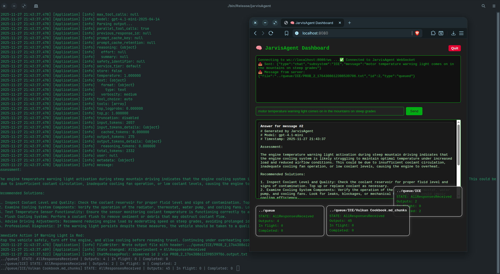

# JarvisAgent

<br>

JarvisAgent is a **C++ console application** that operates as a background service (“agent”) for automated AI-assisted file processing.  <br>
<br>
It monitors a queue folder for prompt and instruction files, sends them to an AI provider through a REST API, and stores the results in an output directory.<br>
<br>
It can perform AI-driven tasks and serve as a component for workflow automation.<br>
<br>
<br>
<br>

---

## Layer Overview

| Layer | Responsibility | Status |
|-------|----------------|--------|
| **Engine** | Networking (`libcurl` and `openssl`), logging (`spdlog`), JSON parsing (`simdjson`), threading (`BS thread-pool`), profiling (`tracy`) | ✅ |
| **Event System** | Thread-safe atomic event queue and dispatcher for cross-thread communication | ✅ |
| **Application** | Orchestrates queue handling, event dispatching, file tracking, and AI query flow | ✅ |
| **Config** | `config.json` with folder paths, thread count, AI backend model, and other settings | ✅ |
| **I/O** | File watcher, categorizer, environment assembly (STNG/CNTX/TASK), automatic binary detection and MarkItDown-based document conversion | ✅ |
| **Networking** | Asynchronous AI query dispatch (HTTP REST via libcurl) with simple multi-model selection | ✅ |

---

## File Categories

JarvisAgent processes different types of prompt files located in the queue folder defined in the configuration file `config.json`.  
Each file category serves a specific purpose, and files are identified using 4-letter, all-caps prefixes.

| Category | Description | Prefix | Example Filename |
|-----------|-------------|---------|------------------|
| **Settings** | Style, behavior, or tone modifiers (e.g., “write succinct”, “use formal tone”) | `STNG` | `STNG_write_succinct.txt` |
| **Context / Description** | Provides contextual or background information for AI prompts | `CNTX` | `CNTX_project_overview.txt` |
| **Task** | Defines the main task or instruction for the AI | `TASK` | `TASK_compare_requirements.txt` |
| **Subfolders** | Contain additional prompt or requirement files, processed recursively | *(folder name itself)* | `queue/subproject/` |
| **Requirements** | Requirement files such as customer or system requirements | *(no prefix)* | `REQ_vehicle_speed.txt` or `customer_requirement_001.txt` |

🧠 Categories **STNG**, **CNTX**, and **TASK** are combined into an **environment** used alongside each individual requirement file during processing.

---

## Architecture & Design Overview

- **Environment Files** — Files in categories STNG (Settings), CNTX (Context/Description), and TASK (Tasks). These form the shared environment or knowledge base.  
- **Query Files (Requirement Files)** — Each represents a smaller task or requirement that is processed using the shared environment.  
- **File Watcher** — Monitors additions, modifications, and removals in the queue folder (including environment and query files).  
- **File Categorizer & Tracker** — Tracks which files belong to which category, monitors modification status, and provides content retrieval.  
- **Binary Detection & Conversion** — Detects binary document formats (PDF, DOCX, HTML, etc.) and uses MarkItDown to convert them to Markdown before querying the AI.  
- **CurlWrapper / REST Interface** — Handles communication with the AI provider’s API (e.g., GPT-4 and GPT-5 models) via HTTP.  
- **Thread Pool / Parallel Processing** — Configured by `maxThreads` in `config.json`; handles multiple query tasks in parallel.  
- **JarvisAgent Application** — Orchestrates startup, event handling, file watching, categorization, and query dispatching.  
- **Core Engine** — Provides globally shared components (thread pool, event queue, logger, config, etc.).  
- **Terminal Renderer ** — Uses PDcurses for advanced log and status display in the console.  

---

## State Machine & Processing Flow

JarvisAgent operates as a **reactive state machine** that responds to file changes:

1. **CompilingEnvironment** — Waits until all STNG, CNTX, and TASK files are available and up to date.  
2. **SendingQueries** — Dispatches requirement (REQ) files in parallel using the assembled environment.  
3. **AllQueriesSent** — Awaits completion of all query futures.  
4. **AllResponsesReceived** — Returns to idle until environment or requirements change.

Any detected file modification automatically triggers selective reprocessing:
- Environment changes ⇒ full environment rebuild.  
- Requirement changes ⇒ re-query for that specific file only.  
- Outputs are **regenerated only when inputs or the environment have changed**, preventing unnecessary re-queries.

---

## Design Highlights

- **Multi-model support** — Compatible with **GPT-4**, **GPT-4.1-mini**, and **GPT-5** through configurable API endpoints.  
- **Output file I/O** — Responses are written to `.output.txt` files and reused when up to date.  
- **Smart dependency tracking** — Automatically re-evaluates files only when their inputs or environment are newer than the output.  
- **Binary-safe file handling** — Automatically skips unsupported binary formats (ZIP, PNG, etc.) and converts supported documents (e.g., PDF, DOCX, HTML) to Markdown via MarkItDown.  
- **Event-driven architecture** — Loosely coupled, non-blocking design.  
- **Atomic dirty tracking** — Modified files are tracked precisely without redundant work.  
- **Parallel querying** — Uses thread pool for concurrent AI requests.  
- **Cross-platform** — Works on Linux, macOS, and Windows.  
- **Web dashboard panel** — Browser-based dashboard for live monitoring of queued, in-flight, and completed tasks.  

---


## Example Queue Folder Layout

```text
queue/
├── STNG_be_succinct.txt
├── CNTX_project_overview.txt
├── TASK_compare_requirements.txt
├── REQ_vehicle_speed.txt
└── subproject/
    ├── STNG_be_formal.txt
    ├── CNTX_subtask.txt
    ├── TASK_subtask.txt
    └── REQ_subsystem_behavior.txt
```


---

## Planned Features

- [ ] Enable HTTP/2 for improved network performance  

---

## Contributions

You are welcome to contribute!  
Please enable **clang-format** in your IDE. The coding style is **Allman**, and member fields of structs and classes use the `m_` + PascalCase convention.

---

## Development

JarvisAgent depends on
* python3 and python3 development headers
* libssl
* libz
* markitdown
* premake5

On Ubuntu, use these commands to install the dependencies:
```
sudo apt install -y python3 python3-pip libssl-dev zlib1g-dev
pipx install "markitdown[all]"
```
Premake5: `git clone https://github.com/premake/premake-core`, build it with `./Bootstrap.sh`, copy executable to /use/bin<br>
<br>
To clone the project, use:

```bash
git clone --recurse-submodules https://github.com/beaumanvienna/JarvisAgent
```
<br>
JarvisAgent is cross-platform. The project is defined in a Lua file for permake5.<br>
<br>
Run 

```bash
premake5 gmake 
```
to get a Makefile.<br><br>
Run

```bash
premake5 vs2022
```
to get a VS solution.<br><br>
Run 

```bash
premake5 xcode4
```
for Xcode on MacOS.<br>
<br>
<br>
If you created a Makefile, build the project with<br>
`export MAKEFLAGS=-j8` or however many CPU cores you want to use<br>
`make config=release verbose=1 && make config=debug verbose=1`<br>
<br>
Run the executable with<br>
`./bin/Release/jarvisAgent` or `./bin/Debug/jarvisAgent`<br>
<br>
To update the source code, use<br>
`git pull && git submodule update --init --recursive`<br>
<br>
Use `premake5 clean` to clean the project from build artifacts.<br>
<br>
<br>
<br>

GPL-3.0  License © 2025 JC Technolabs
