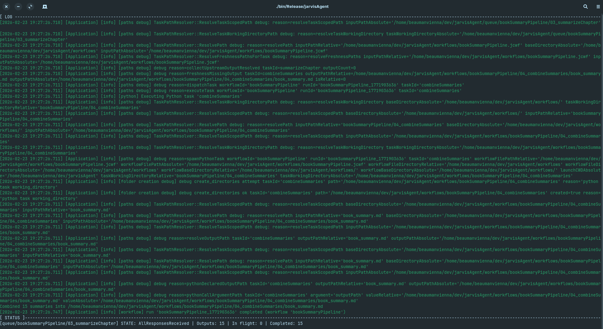
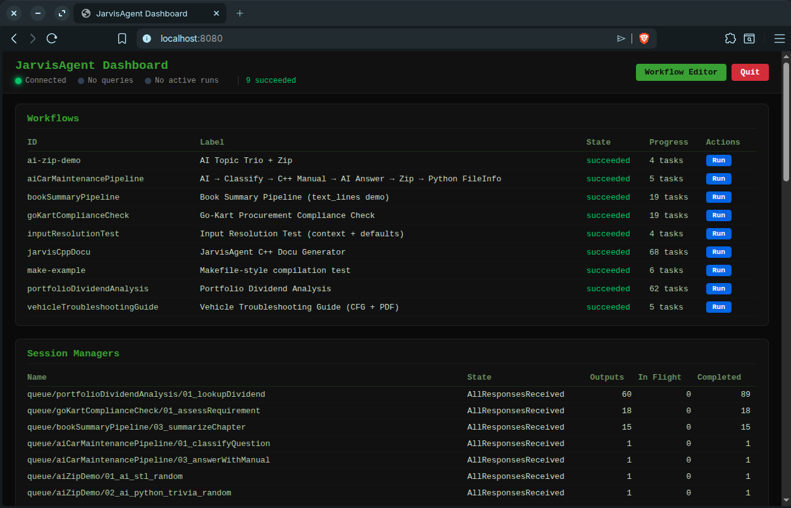
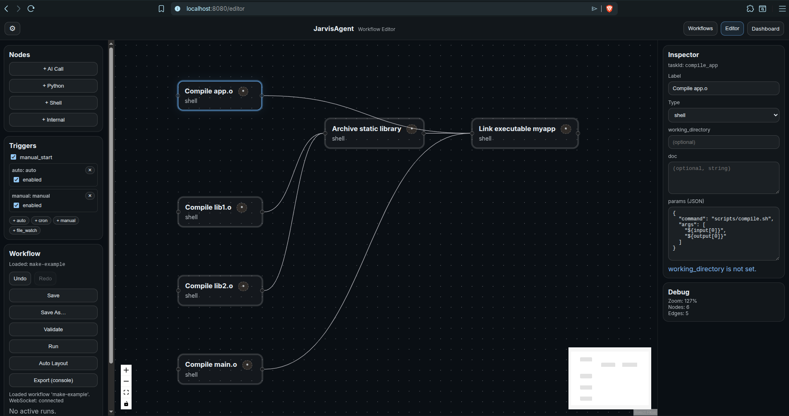

<br>


# JarvisAgent (j9t)


JarvisAgent is a **modern** C++ orchestration engine with a React frontend for AI-driven automation. It is **fast** for two reasons: hundreds of AI calls run at the same time rather than one after another, and all outgoing requests share a single HTTP/2 connection per provider — so network overhead stays minimal no matter how many tasks are in flight.  <br>
<br>
Choose your platform — Linux (DEB, RPM, Arch, AppImage, Flatpak), macOS (DMG, Homebrew), or Windows (MSI) — or run the published Docker image if you need an isolated, reproducible environment. Workflows are defined as visual DAGs (directed acyclic graphs) in the **workflow editor**: drag-and-drop nodes, draw dependency and dataflow edges, and watch tasks animate through running → succeeded / failed states in real time with stdout/stderr surfaced directly on each node. When something goes wrong the **fix-it** button sends the error to the AI for a suggested repair; the **explain** button summarises what a workflow does in plain language; and the **generate** button drafts an entirely new workflow from a natural language description.  <br>
<br>
JarvisAgent (j9t) comes in two editions: **j9t Studio**, an easy-to-use workspace for designing and managing AI workflows with a visual editor and built-in AI assistant, and **j9t Engine**, a streamlined production edition built for secure enterprise deployment. Studio is designed for teams who create and refine workflows, while Engine is optimized to run them reliably and securely at scale in production environments. Both editions are included in every package. Engine includes enterprise-grade security features such as secure login access, encrypted communication, role-based permissions, protection against unauthorized access attempts, and detailed security audit trails — making it ready for deployment in a private cloud or behind a company's secure network gateway.<br>
<br>
The **React dashboard** gives an overview of active workflow runs, AI session counts, and completed/failed counters. Its **log viewer** streams up to 100,000 lines live with color-coded severity, and the **Run Analyzer** overlay (press `1`) maps every run to its log region, lists all warnings and errors with one-click navigation, and lets you step through issues with ▲ / ▼.  <br>
<br>
Tasks can be AI calls, shell commands, **Python scripts** (executed by the embedded Python engine), or internal C++ actions. The **AI assistant** has 31 specialized tools — it can read and write workflow files, run tasks, inspect logs, and query the running engine — going well beyond a chat interface. Workflows can be triggered on a cron schedule, automatically or manually, or via webhooks with HMAC signature verification, integrating with n8n or any HTTP-capable orchestrator.  <br>
<br>
Office documents (Word, Excel, PowerPoint, PDF) are converted to Markdown before being sent to the AI via [MarkItDown](https://github.com/microsoft/markitdown), and chunked automatically when too large. All inputs, outputs, and intermediate results live on disk.  <br>
<br>
**Cloud integration** — workflows read from and write to external systems through a unified connector layer: object storage (S3, Azure Blob, Google Cloud Storage), databases (PostgreSQL, Snowflake), file collaboration (OneDrive, Google Sheets), ALM tools (Polarion, Jira, GitHub), and messaging (Slack, Email). Credentials are stored encrypted, never appear in workflow files, and a single connection definition is reused across all tasks. **Why it matters for the business:** the same automation pipeline can pull data from where it already lives, run AI analysis on it, and push results back into the systems your teams already use — no manual export/import, no separate integration scripts to maintain, and no vendor lock-in.<br>
<br>
**Current version: 0.8.5** — working towards **beta 0.95**, the first major baseline subject to regression testing across all packaging targets.<br>
<br>
| Terminal UI | Dashboard | Workflow Editor |
|:-----------:|:---------:|:---------------:|
|  |  |  |

<br>

---

## Layer Overview

| Layer | Responsibility | Status |
|-------|----------------|--------|
| **Engine** | Networking (`libcurl` + `openssl`), logging (`spdlog`), JSON parsing (`simdjson`), threading (`BS thread-pool`), profiling (`tracy`) | ✅ |
| **Event System** | Thread-safe atomic event queue and dispatcher for cross-thread communication | ✅ |
| **Workflow Runtime** | DAG-based workflow engine — serial/parallel task execution, cron/file-watch/webhook triggers, error branching, run control (pause/resume/stop), timezone-aware scheduling | ✅ |
| **Application** | Orchestrates queue handling, event dispatching, file tracking, and AI query flow | ✅ |
| **Config** | `config.json` with folder paths, thread count, AI backend model, and other settings | ✅ |
| **I/O** | File watcher, categorizer, environment assembly (STNG/CNTX/TASK), automatic binary detection and MarkItDown-based document conversion | ✅ |
| **Networking** | Asynchronous AI query dispatch (HTTP REST via libcurl) with multi-model selection | ✅ |
| **Security** | Bearer token auth, RBAC (admin/operator/viewer), gateway identity headers, rate limiting, auth lockout, token expiry/rotation, HMAC webhooks, TLS, security audit log, CSP/security headers | ✅ |
| **Frontend** | React workflow editor (ReactFlow graph UI), AI workflow generator, workflow versioning, live run monitoring via WebSocket | ✅ |
| **Cloud Integration** | Unified `ICloudConnector` framework, named connections, encrypted credential resolution, 12 connectors (object storage, databases, ALM, messaging, files); MCP sidecar for Claude/AI assistants | ✅ |

---

## File Categories

JarvisAgent processes different types of prompt files located in the queue folder defined in the configuration file `config.json`.  
Each file category serves a specific purpose, and files are identified using 4-letter, all-caps prefixes.

| Category | Description | Prefix | Example Filename |
|-----------|-------------|---------|------------------|
| **Settings** | Style, behavior, or tone modifiers (e.g., "write succinct", "use formal tone") | `STNG` | `STNG_write_succinct.txt` |
| **Context / Description** | Provides contextual or background information for AI prompts | `CNTX` | `CNTX_project_overview.txt` |
| **Task** | Defines the main task or instruction for the AI | `TASK` | `TASK_compare_requirements.txt` |
| **Provider** | AI provider configuration (endpoint, model) — content is **never** sent to the AI | `PROV` | `PROV_provider.json` |
| **Subfolders** | Contain additional prompt or requirement files, processed recursively | *(folder name itself)* | `queue/subproject/` |
| **Requirements** | Requirement files such as customer or system requirements | *(no prefix/PROB_)* | `REQ_vehicle_speed.txt` or `customer_requirement_001.txt` |

🧠 Categories **STNG**, **CNTX**, and **TASK** are combined into an **environment** used alongside each individual requirement file during processing.

---

## Architecture & Design Overview

- **JC Workflow Files (`.jcwf`)** — JSON-based workflow definitions that describe a DAG of tasks, their dependencies, triggers, filters, and data flow. Each task can be an `ai_call`, `shell` command, `python` script, or `internal` C++ module. Tasks with no mutual dependency run in parallel. The [JC Workflow Specification](doc/JC_Workflow_Specification.md) defines the format, path-resolution rules, and execution model.
- **Per-item fan-out and filters** — A filter (CSV, text_lines, or Polarion query) produces a list of items. A `per_item` task spawns one AI call per item, all running in parallel. For example, a 60-position stock portfolio CSV yields 60 concurrent dividend-lookup queries, each receiving only its own row as context. This isolation improves accuracy: the AI focuses on a single item rather than parsing a large table, and every response is independently verifiable. A downstream aggregation task then consumes all 60 results via a glob pattern.
- **Queue binding and environment assembly** — `ai_call` tasks declare inline STNG, TASK, CNTX, and PROB files. Template variables (`{{binding.field}}`) are expanded per filter item. The assembled files are written to disk and picked up by the session manager for dispatch.
- **REST API and WebSocket** — JarvisAgent exposes a full REST API (`/api/workflows`, `/api/workflows/<id>/run`, `/api/workflows/<id>/clean`, `/api/status`, etc.) for workflow CRUD, run control, and live status. A WebSocket channel pushes real-time task-state updates to the React dashboard and workflow editor. See [doc/api-endpoints.md](doc/api-endpoints.md).
- **Cloud connector layer** — `ICloudConnector` abstracts authentication (OAuth2, JWT, SigV4, Azure Shared Key, BasicAuth, Bearer) so task executors only deal with resolved credentials. Named `CloudConnection` configs centralise endpoint and key references; secrets stay in the encrypted key store. New connectors plug in by implementing the interface and registering with the connector registry. See [doc/cloud-integration.md](doc/cloud-integration.md).
- **Environment Files** — Files in categories STNG (Settings), CNTX (Context/Description), and TASK (Tasks). These form the shared environment or knowledge base.  
- **Query Files aka Requirement Files aka PROB Files** — Each represents a smaller task or requirement that is processed using the shared environment.  
- **File Watcher** — Monitors additions, modifications, and removals in the queue folder (including environment and query files).  
- **File Categorizer & Tracker** — Tracks which files belong to which category, monitors modification status, and provides content retrieval.  
- **Binary Detection & Conversion** — Detects binary document formats (PDF, DOCX, HTML, etc.) and uses MarkItDown to convert them to Markdown before querying the AI.  
- **CurlWrapper / REST Interface** — Handles communication with AI provider APIs (OpenAI GPT-4/GPT-5, Google Gemini) via HTTP, supporting both Bearer and `x-goog-api-key` authentication.  
- **Thread Pool / Parallel Processing** — Configured by `maxThreads` in `config.json`; handles multiple query tasks in parallel.  
- **JarvisAgent Application** — Orchestrates startup, event handling, file watching, categorization, and query dispatching.  
- **Core Engine** — Provides globally shared components (thread pool, event queue, logger, config, etc.).  
- **Terminal Renderer** — Uses PDcurses for advanced log and status display in the console.  

---

## State Machine & Processing Flow

JarvisAgent operates as a **reactive state machine** that responds to file changes:

1. **CompilingEnvironment** — Waits until all STNG, CNTX, and TASK files are available and up to date.  
2. **SendingQueries** — Dispatches requirement (REQ) files in parallel using the assembled environment.  
3. **AllQueriesSent** — Awaits completion of all query futures.  
4. **AllResponsesReceived** — Returns to idle until environment or requirements change.

Any detected file modification automatically triggers selective reprocessing:
- Environment changes ⇒ full environment rebuild.  
- Requirement changes ⇒ re-query for that specific file only.  
- Outputs are **regenerated only when inputs or the environment have changed**, preventing unnecessary re-queries.

---

## Design Highlights

- **Massively parallel AI engine** — Thread pool dispatches hundreds of concurrent AI requests for bulk processing workloads.  
- **Multi-model support** — Compatible with **GPT-4**, **GPT-4.1-mini**, **GPT-5**, and **Google Gemini** (both OpenAI-compatible and native API) through configurable API endpoints.  
- **Visual workflow editor** — React-based graph UI for building DAG workflows with drag-and-drop nodes, auto-layout, and live run status.  
- **Flexible task types** — Workflow tasks can be AI calls, Python scripts, shell commands, or native C++ — mixed freely in serial and parallel.  
- **Triggers & scheduling** — Cron (with IANA timezone), file-watch, webhook (HMAC-SHA256), manual, and auto-start triggers.  
- **Office document conversion** — PDF, DOCX, XLSX, PPTX, and HTML are converted to Markdown via Microsoft MarkItDown before AI processing.  
- **Smart dependency tracking** — Re-evaluates files only when inputs or environment have changed, preventing unnecessary re-queries.  
- **n8n integration** — Custom n8n node (`n8n-nodes-jarvisagent`) for triggering workflows from n8n. Supports HMAC signing, context injection, and completion callbacks that deliver AI output back to n8n for downstream routing (email, Slack, etc.).  
- **AI workflow generation** — Describe a workflow in natural language and the AI assistant generates the JCWF definition, decomposes tasks, and produces Python or shell scripts (bash `.sh` on Linux/macOS, PowerShell `.ps1` on Windows) — with validation and auto-fix.  
- **Error branching** — Branch nodes and controlflow edges route execution on task success or failure, enabling automatic retry and recovery patterns.  
- **Run control** — Pause, resume, and stop running workflows via REST API or the editor UI.  
- **Workflow versioning** — Auto-backup on every save with full restore history. Browse and restore previous versions from the editor.  
- **Dual UI** — ncurses terminal UI for headless/SSH operation, plus a browser-based React dashboard for remote monitoring.  
- **Encrypted API key management** — AES-256-GCM encrypted key store with master password, per-provider key names, and runtime key resolution via `key_name` in config.json interfaces.  
- **Per-item fan-out** — CSV, text_lines, and Polarion filters produce item lists; `per_item` tasks spawn one AI call per item, all running in parallel.  
- **Cloud connectors** — Unified framework for object storage (S3, Azure Blob, GCS), databases (PostgreSQL, Snowflake), file collaboration (OneDrive, Google Sheets), ALM (Polarion, Jira, GitHub), and messaging (Slack, Email). Per-item output piping enables full round-trip pipelines: read from cloud → fan out per item → AI processes each → write results back.  
- **Task watchdog** — Inactivity-based timeout with heartbeat support for long-running shell and Python tasks.  
- **Event-driven architecture** — Loosely coupled, non-blocking design with thread-safe event queue.  
- **Cross-platform** — Compiles and runs on **Linux** (GCC), **macOS** (Clang), and **Windows** (MSVC).  

---


## Example Queue Folder Layout

```text
queue/
├── STNG_be_succinct.txt
├── CNTX_project_overview.txt
├── TASK_compare_requirements.txt
├── REQ_vehicle_speed.txt
└── subproject/
    ├── STNG_be_formal.txt
    ├── CNTX_subtask.txt
    ├── TASK_subtask.txt
    └── REQ_subsystem_behavior.txt
```


---

## Example Workflows

| Workflow | Highlights |
|----------|------------|
| [Go-Kart Compliance Check](example/workflows/goKartComplianceCheck.md) | Polarion integration, per-item fan-out, `{{template}}` substitution |
| [Portfolio Dividend Analysis](example/workflows/portfolioDividendAnalysis.md) | CSV filter, 60-position fan-out, glob-based aggregation |
| [AI Car Maintenance Pipeline](example/workflows/aiCarMaintenancePipeline.md) | Retrieves user manuals based on AI categorization, multi-stage pipeline |
| [Vehicle Troubleshooting Guide](example/workflows/vehicleTroubleshootingGuide.md) | AI-generated flow charts based on user prompt, shell + AI pipeline |
| [Make-Style Build Example](example/workflows/make_example.md) | Classic dependency graph, file I/O, shell tasks |
| [Hamburg Tourist Day Planner](example/workflows/hamburg-tourist-day-planner.md) | Webhook trigger, n8n integration, HMAC signing, completion callback with AI output |
| [S3 Round-Trip](example/workflows/s3UploadDownloadDemo.md), [PostgreSQL](example/workflows/postgresDemo.md), [Email](example/workflows/emailDemo.md), [GitHub](example/workflows/gitHubIssueDemo.md), [Azure Blob](example/workflows/azureBlobDemo.md), [GCS](example/workflows/gcsDemo.md) | Cloud round-trip demos: upload data → AI processes → write results back. Per-item fan-out + output piping. |

---

## Cloud Connectors

The cloud integration layer provides a unified interface for connecting workflows to external systems. All connectors share the same encrypted credential store, retry policy, audit logging, and per-item output piping.

| Connector | Auth | Description |
|-----------|------|-------------|
| **Polarion** | Bearer (PAT) | Requirements & ALM. Run Lucene queries against work items, fan out per requirement for AI assessment, and write results back via PATCH (compliance status, links, attachments). |
| **S3** | SigV4 | Object storage (AWS S3, MinIO, Wasabi, Cloudflare R2, GCS S3-interop). Upload, download, list, and delete blobs. Common pattern: drop a file, AI analyses it, result lands back in the bucket. |
| **PostgreSQL** | BasicAuth | Run SQL queries via libpq, write results to CSV/JSON, and INSERT AI-generated rows back into the database. Built for analytics pipelines and per-row enrichment. |
| **Email** (SMTP/IMAP) | BasicAuth | Send messages with MIME attachments via SMTP and read incoming messages from IMAP folders. Use cases: automated outreach, AI replies to support tickets, alerting. |
| **GitHub** | Bearer (PAT) | List, create, comment, and close issues, plus retrieve repository files. Common pattern: AI triages new issues automatically and posts a comment with severity, root cause hypothesis, and suggested labels. |
| **Azure Blob** | Shared Key or Azure AD OAuth2 | Native Azure Blob Storage REST API (not S3-compatible). Upload and download blobs with full Azure feature support: tiers, metadata, Data Lake Gen2 hierarchical namespace. |
| **GCS** (native) | Service account JWT → OAuth2 | Native Google Cloud Storage JSON API. Upload and download objects. Uses standard GCP service account auth instead of HMAC interop keys. |
| **OneDrive** | OAuth 2.0 PKCE | Microsoft Graph API for personal and work OneDrive accounts. Upload, download, and watch folders for new files. Suitable for document workflows where files arrive from end users. |
| **Snowflake** | RSA JWT | Cloud data warehouse via the SQL REST API with key-pair authentication. Run analytical queries, fan out per row for AI classification, INSERT verdicts back. No password handling, JWT is minted and rotated automatically. |
| **Slack** | Bearer (Bot token) | Post messages to channels via the Slack Web API. Used for notifications: workflow status, AI-generated summaries, alerts, and routing of cloud events to human operators. |
| **Jira** | BasicAuth or Bearer | Atlassian Cloud Jira REST API v3. Create, update, transition, comment on, and query issues. Common pattern: ingest tickets, AI categorises and enriches, write results back. |
| **Google Sheets** | API key or OAuth2 | Read and write spreadsheet ranges via the Sheets API v4. Useful when business data lives in shared sheets — read a range, AI processes it, write results into adjacent columns. |

Connections are managed through the workflow editor's **Connections** tab. Adding a new connector takes ~200 lines of C++: implement `ICloudConnector::TestConnection()` + `ResolveCredentials()`, plus a task executor that extends `ICloudTaskExecutor`. The base class handles connection lookup, credential resolution, circuit breaker, audit logging, cancellation tokens, and template variable expansion automatically.

The framework also exposes an **MCP sidecar** so Claude Desktop, Claude Code, and other MCP clients can list and run workflows directly. See [doc/cloud-integration.md](doc/cloud-integration.md) for the full architecture and per-connector details.

---

## Completed Features

- [x] Docker deployment & CI/CD — 3-stage build, pushed to GHCR ([AhmetErenLacinbala](https://github.com/AhmetErenLacinbala))  
- [x] Native Google Gemini reply parser (API3 — `x-goog-api-key` auth, `/models/{model}:generateContent` URL scheme)  
- [x] n8n workflow integration — webhook triggers, HMAC-SHA256, completion callbacks, custom n8n node  
- [x] AI workflow generation — natural language → JCWF + scripts (decompose → generate → validate → fix)  
- [x] Error branching & controlflow — branch nodes, error-signal edges, automatic retry/recovery  
- [x] Workflow versioning — auto-backup on save, browse & restore from editor  
- [x] Browser-based AI assistant — 31 tools, multi-step reasoning, file I/O, shell execution, workspace memory  
- [x] HTTP/2 multiplexing — all concurrent AI requests share a single TLS connection per provider via a dedicated I/O thread  
- [x] Engine security hardening — bearer token auth, HMAC webhooks, rate limiting, auth lockout, token auto-expiry/rotation, security audit logging, built-in TLS, RBAC (admin/operator/viewer), gateway identity headers, request body limits, security response headers (CSP, X-Frame-Options, HSTS)  
- [x] Python engine parallelization — N sub-interpreters with per-engine worker threads and load-balanced task dispatch (Python 3.12+; graceful fallback to single engine on older Python)  
- [x] Cloud integration — 12 native connectors (Polarion, S3, OneDrive, Snowflake, PostgreSQL, Slack, Email, GitHub, Jira, Google Sheets, Azure Blob, GCS), MCP sidecar for Claude/AI assistants, named connections with encrypted credentials (OAuth2/JWT/SigV4/Shared Key), per-item cloud write-back via output piping  

### Remaining

- [ ] Sub-workflows / workflow-call node

---

## Contributions

You are welcome to contribute!  
Please enable **clang-format** in your IDE. The coding style is **Allman**, and member fields of structs and classes use the `m_` + PascalCase convention.

---

## User Manual

The full user manual is available as:
- **Man page** (Linux/macOS): `man jarvisagent` (installed with DEB, RPM, Arch, Homebrew packages)
- **Online / all platforms**: [doc/jarvisagent.md](https://github.com/beaumanvienna/JarvisAgent/blob/main/doc/jarvisagent.md#jarvisagent1--jarvisagent-user-manual)

It covers editions (Studio vs Engine), CLI options, `config.json` fields, environment variables, AI key setup, security, workflow concepts, and the workflow editor.

---

## Pre-built Packages

Pre-built packages for all platforms are available as GitHub Actions artifacts.
Go to the [Actions](https://github.com/beaumanvienna/JarvisAgent/actions) tab and download from the latest successful run:

| Platform | Format | Artifact |
|----------|--------|----------|
| Ubuntu / Debian | `.deb` | `JarvisAgent-<version>-deb` |
| Fedora / RHEL / Rocky | `.rpm` | `JarvisAgent-<version>-rpm` |
| Arch / Manjaro | `.pkg.tar.zst` | `JarvisAgent-<version>-arch` |
| Any Linux | `.AppImage` | `JarvisAgent-<version>-AppImage` |
| Any Linux (sandboxed) | `.flatpak` | `JarvisAgent-<version>-flatpak` |
| macOS | `.dmg` | `JarvisAgent-<version>-macOS-dmg` |
| Windows (portable) | `.zip` | `JarvisAgent-<version>-Windows-zip` |
| Windows (installer) | `.msi` | `JarvisAgent-<version>-Windows-msi` |
| Docker | OCI image | `ghcr.io/beaumanvienna/jarvisagent:latest` |

**DEB** (Ubuntu / Debian / Zorin / Linux Mint / Pop!_OS):

Install from the PPA (recommended):
```bash
sudo add-apt-repository ppa:beauman/marley
sudo apt update
sudo apt install jarvisagent
jarvisagent
```

Or install a local `.deb`:
```bash
sudo dpkg -i jarvisagent_*_amd64.deb
sudo apt install -f
jarvisagent
```

To uninstall:
```bash
sudo apt remove jarvisagent
```

**RPM** (Fedora / RHEL / Rocky / CentOS):

```bash
sudo dnf install ./jarvisagent-0.75-1.x86_64.rpm
jarvisagent
```

To uninstall:
```bash
sudo dnf remove jarvisagent
```

**Arch** (Arch / Manjaro):

```bash
sudo pacman -U jarvisagent-0.75-1-x86_64.pkg.tar.zst
jarvisagent
```

To uninstall:
```bash
sudo pacman -R jarvisagent
```

> **Note:** Version numbers in the commands above are examples — replace with the version you downloaded.

All Linux packages install to `/opt/jarvisagent/` with a launcher at `/usr/bin/jarvisagent`.
On first run, the launcher creates a per-user working directory at `~/JarvisAgent` with config,
workflows, and a Python virtual environment. Options: `--home DIR` (custom path),
`--no-browser` (skip opening dashboard).

**AppImage:**

```bash
chmod +x JarvisAgent-x86_64.AppImage
./JarvisAgent-x86_64.AppImage
```

On first run, the wrapper creates a working directory at `~/JarvisAgent`
with example workflows, a default `config.json`, and a Python virtual environment.

**Flatpak:**

```bash
flatpak install --user JarvisAgent.flatpak
flatpak run com.jctechnolabs.JarvisAgent
```

On first run, the wrapper creates a working directory at `~/JarvisAgent`
with example workflows, a default `config.json`, and a Python virtual environment.

To uninstall:
```bash
flatpak uninstall --user com.jctechnolabs.JarvisAgent
# and remove user data in ~/JarvisAgent   
```

**macOS DMG:**

Open the `.dmg`, drag `JarvisAgent.app` to `/Applications`, then launch:
```bash
open /Applications/JarvisAgent.app
```

On first run, the launcher creates `~/JarvisAgent` with config, workflows, and a Python venv.

To uninstall:
```bash
rm -rf /Applications/JarvisAgent.app
# and remove user data in ~/JarvisAgent
```

**Windows MSI:**

Double-click the `.msi` installer. After installation, run from any terminal:
```
jarvisagent
```

Installs to `C:\Program Files\JarvisAgent\` and adds it to the system PATH.
On first run, the launcher creates `%USERPROFILE%\JarvisAgent` with config, workflows, and a Python venv.

To uninstall: Windows Settings → Apps → JarvisAgent → Uninstall.

**Windows ZIP** (portable):

Extract the `.zip` and run `jarvisagent.bat` from the extracted folder.

**Docker:**

```bash
./scripts/run-docker.sh                    # interactive with TUI
./scripts/run-docker.sh --headless         # headless (no TUI, web only)
./scripts/run-docker.sh /custom/path       # custom data directory
./scripts/run-docker.sh --headless /path   # headless + custom data dir
```

```powershell
.\scripts\run-docker.ps1                    # Windows PowerShell
.\scripts\run-docker.ps1 -DataDir C:\path   # custom data directory
```

Or manually:

```bash
docker pull ghcr.io/beaumanvienna/jarvisagent:latest

mkdir -p ~/JarvisAgent
docker run -it --rm \
  -p 8080:8080 \
  -v ~/JarvisAgent:/app \
  ghcr.io/beaumanvienna/jarvisagent:latest
```

- Dashboard: http://localhost:8080 (or https://localhost:8443 with TLS)
- Workflow Editor: http://localhost:8080/editor (or https://localhost:8443/editor with TLS)
- The `-v` flag mounts `~/JarvisAgent` on the host so workflows, AI keys, and outputs persist across container restarts.

**Setting up AI providers** (first run):

1. Open the Workflow Editor at http://localhost:8080/editor (or https://localhost:8443/editor with TLS)
2. Go to **AI Keys** → **+ Add Key** — enter a name (e.g. `openai`) and paste your API key, then click **Create**. Click **Save Encrypted** to persist the key.
3. Go to **AI Manager** — select your key from the **Key** dropdown for each provider interface, then click **Save to config.json**.

See [packaging/packaging.md](packaging/packaging.md) for build scripts and detailed instructions.

---

## Building from Source

```bash
git clone https://github.com/beaumanvienna/JarvisAgent
cd JarvisAgent
```

JarvisAgent depends on
* Python 3 and development headers (on Ubuntu/Debian the packages are called `python3`, `python3-dev`)
* libz (Linux — linked at build time; vendored on Windows, included in Xcode SDK on macOS)
* premake5
* markitdown (document conversion)
* pandoc + pdflatex (Markdown → PDF — required for PDF workflows; see platform-specific install commands below)
* mmdc — @mermaid-js/mermaid-cli (Mermaid diagram rendering — installed automatically by the launcher script)

> OpenSSL and libcurl are vendored in the repository and built from source on all platforms.

### Linux (Ubuntu / Debian)

```bash
sudo apt install -y python3 python3-pip python3-dev python3-venv zlib1g-dev
```

Premake5: `git clone https://github.com/premake/premake-core`, build it with `./Bootstrap.sh`, copy the executable to `/usr/bin`.

### Linux (Fedora / RHEL / Rocky Linux)

```bash
sudo dnf install -y gcc-c++ make python3 python3-devel python3-pip zlib-devel nodejs npm
```

On RHEL / Rocky Linux you may need EPEL for additional packages:
```bash
sudo dnf install -y epel-release
sudo dnf makecache
```

Premake5 is not in the Fedora/EPEL repos — build from source:
```bash
git clone https://github.com/premake/premake-core
cd premake-core
sudo dnf install -y libuuid-devel   # required by Bootstrap.sh
./Bootstrap.sh
sudo cp bin/release/premake5 /usr/bin/
```

### macOS

```bash
brew install python3 node
```

Premake5: download from [premake.github.io](https://premake.github.io/download) or build from source as above.

### Windows

Install [Python 3](https://www.python.org/downloads/) (make sure to check **"Add to PATH"**).  
Premake5: download the Windows binary from [premake.github.io](https://premake.github.io/download) and add it to your PATH.

---

### Windows: PowerShell (default) or Bash

On Windows, JarvisAgent's shell-based workflow tasks run through **PowerShell** by default. No extra setup is required — just launch JarvisAgent normally.

Shell scripts (`.sh`) have PowerShell siblings (`.ps1`) that are used automatically on Windows. New `.ps1` scripts generated by the AI assistant follow PowerShell conventions (`param()` block, `Set-StrictMode -Version Latest`, `$ErrorActionPreference = 'Stop'`).

If you prefer **MSYS2 / Git Bash**, set `"use_bash": true` in `config.json` (or toggle it in the Settings panel). JarvisAgent will probe `PATH` for `bash` at startup and fall back to PowerShell with a warning if bash is not found.

> **Recommendation:** Use the default PowerShell mode unless you have existing `.sh` scripts without `.ps1` siblings or rely on specific POSIX tools not available in PowerShell.

---

### Python Virtual Environment

JarvisAgent's shell-based workflows call Python tools (`markitdown`) and system tools (`pandoc`, `mmdc`). The Python tools are installed in a **virtual environment** managed automatically by the launcher script. `mmdc` (mermaid-cli) is also installed automatically by the launcher on first run. Only `pandoc` and texlive require manual installation (see below).

**Create and activate the venv** (one-time setup):

Linux / macOS:
```bash
python3 -m venv .venv   # use 'python3' here; after activation, 'python' works everywhere
source .venv/bin/activate
```

Windows (PowerShell):
```powershell
python -m venv .venv
.\.venv\Scripts\Activate.ps1
```

Windows (MSYS2 / Git Bash):
```bash
python -m venv .venv
source .venv/Scripts/activate
```

**Install the Python dependencies** (inside the active venv, same on all platforms):

```bash
pip install "markitdown[all]"
```

For PDF workflows (`vehicleTroubleshootingGuide`), install pandoc and a LaTeX distribution once. The launcher script installs `mmdc` (mermaid-cli) automatically.

```bash
# Linux (Ubuntu / Debian)
sudo apt install pandoc texlive-latex-base texlive-latex-extra texlive-fonts-recommended

# Linux (Fedora / RHEL)
sudo dnf install pandoc texlive-latex

# Linux (Arch)
sudo pacman -S pandoc texlive-bin

# macOS
brew install pandoc basictex

# Windows
choco install pandoc miktex
```

**Quick start** — use the launcher script (creates the venv automatically on first run):

Linux / macOS:
```bash
./jarvisagent.sh
```

The script creates `.venv`, installs all Python dependencies, and launches the release binary.  
On subsequent runs it simply activates the existing venv and starts JarvisAgent.

**Manual session** — if you prefer to manage the venv yourself:

Linux / macOS:
```bash
$ source .venv/bin/activate
(.venv) $ ./bin/Release/jarvisAgent-studio
```

Windows (MSYS2 / Git Bash):
```bash
$ source .venv/Scripts/activate
(.venv) $ ./bin/x64/Release/jarvisAgent-studio.exe
```

> **Note:** Always activate the venv before running JarvisAgent so that `markitdown` is on the PATH.

---

### React UIs (Dashboard & Workflow Editor)

The browser-based Dashboard and Workflow Editor are React apps built with [Vite](https://vite.dev/).  
You need **Node.js** (v18+) and **npm** to build them.

**Install Node.js:**

| Platform | Command |
|----------|---------|
| **Linux (Ubuntu/Debian)** | `sudo apt install -y nodejs npm` (or use [nvm](https://github.com/nvm-sh/nvm)) |
| **macOS** | `brew install node` (or use [nvm](https://github.com/nvm-sh/nvm)) |
| **Windows** | Download the installer from [nodejs.org](https://nodejs.org/) |

**Build the UIs** (same on all platforms):

```bash
# Dashboard
cd dashboard/ui
npm install
npm run build

# Workflow Editor
cd ../../workflow-editor/ui
npm install
npm run build
```

The build output lands in `dashboard/ui/dist/` and `workflow-editor/ui/dist/` respectively.  
JarvisAgent serves these automatically at `http://localhost:8080` (dashboard) and `http://localhost:8080/editor` (workflow editor). With TLS enabled (`"TlsCert"` and `"TlsKey"` in config.json), the default port changes to `8443` — configurable via `"port"` in config.json.

---

### Editions

JarvisAgent builds as two editions from the same source tree. Each produces a distinctly named binary:

| Edition | Flag | Binary | Use case |
|---------|------|--------|----------|
| **j9t Studio** (default) | *(none)* or `--studio` | `jarvisAgent-studio` | Developer workstation — workflow editor, AI assistant, config management |
| **j9t Engine** | `--engine` | `jarvisAgent-engine` | Production server — lean, no editing surface, full security stack (auth, RBAC, TLS, audit log) |

### Building

Generate build files with premake5, then build:

```bash
# Studio edition (default — full developer IDE)
premake5 gmake
make config=release          # → bin/Release/jarvisAgent-studio

# Engine edition (lean production server)
premake5 gmake --engine
make config=release          # → bin/Release/jarvisAgent-engine
```

On Windows, replace `gmake` with `vs2022` to generate a Visual Studio solution. On macOS, `xcode4` generates an Xcode project.

Each edition has its own intermediate directory (`bin-int/studio/` vs `bin-int/engine/`), so switching editions triggers a clean rebuild automatically.

Set parallel build flags for faster compilation:
```bash
export MAKEFLAGS=-j$(nproc)   # Linux
export MAKEFLAGS=-j$(sysctl -n hw.ncpu)   # macOS
```

### Running

**Launcher script** (handles Python venv automatically):
```bash
./jarvisagent.sh              # Studio edition (default)
./jarvisagent.sh --engine     # Engine edition
```

**Direct binary** (requires an active Python venv):
```bash
./bin/Release/jarvisAgent-studio    # Studio
./bin/Release/jarvisAgent-engine    # Engine
```

- Dashboard: http://localhost:8080 (or https://localhost:8443 with TLS)
- Workflow Editor: http://localhost:8080/editor (Studio only; https://localhost:8443/editor with TLS)
- The listen port is configurable via `"port"` in config.json (default: 8080 HTTP, 8443 HTTPS)

### Engine Security

Engine edition includes a full security stack. Studio has no auth (developer workstation — localhost only).

**Authentication:** On first start, a 256-bit random token is auto-generated, saved to `engine_api_token.txt` (file permissions `600`), and printed to stdout. Tokens auto-expire after 90 days and auto-rotate. Include the token in every request:
```bash
curl -H "Authorization: Bearer <token>" http://host:8080/api/workflows
```

**Gateway integration:** When deployed behind an API gateway (Kong, AWS API Gateway, Traefik), configure `TrustedProxyHeader` and `TrustedRoleHeader` in `config.json` so j9t reads the authenticated user identity and role from gateway-injected headers.

**RBAC:** Three roles — `admin` (full access incl. shutdown, security logs), `operator` (run control, app logs), `viewer` (read-only monitoring). Gateway mode maps roles from headers; bearer token grants admin.

**Defense layers:** Per-IP rate limiting (100 req/min, burst 20), failed auth lockout (10 failures → 15-min IP ban), request body size limit (configurable, default 10 MB), security response headers (CSP, X-Frame-Options, HSTS, Referrer-Policy).

**Audit logging:** All auth events, webhook decisions, and run control actions logged to `log/security.txt` with IP, user identity, role, and endpoint. Viewable in the dashboard's Security tab.

**TLS:** Built-in HTTPS via `TlsCert`/`TlsKey` in config.json (port 8443), or deploy behind a TLS-terminating reverse proxy.

**Dashboard:** prompts for the admin token on first load, stores it in localStorage. A **Logout** button clears it.

**WebSocket:** clients must send `{"type":"auth","token":"<token>"}` as the first message.

**Public endpoints** (no auth): `GET /api/status`, `GET /` (dashboard HTML shell).

**Webhook endpoints** use per-workflow HMAC-SHA256 signatures (separate from the admin token). In Engine mode, a webhook secret is mandatory.

See [doc/cyber security.md](doc/cyber%20security.md) for the full threat model, deployment architecture, and operator responsibilities.

### Updating

```bash
git pull && git submodule update --init --recursive
```

Use `premake5 clean` to clean the project from build artifacts.

---

GPL-3.0  License © 2026 JC Technolabs
