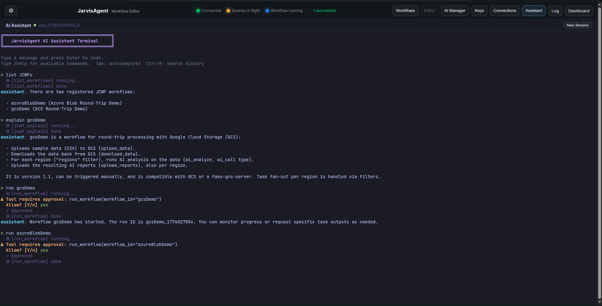

<br>


# JarvisAgent (j9t)

**Massively parallel AI workflow orchestration in modern C++ with a React visual editor.**

JarvisAgent combines **AI calls, Python, shell scripts, and internal C++ tasks** into visual DAG workflows that execute hundreds of tasks in parallel. It is fast for two reasons: concurrent AI requests run simultaneously rather than serially, and all outgoing requests share a single HTTP/2 connection per provider — so network overhead stays minimal no matter how many tasks are in flight.

JarvisAgent ships in two editions, both included in every package:

- **j9t Studio** — visual workflow editor with AI generation, explain, and auto-fix; AI assistant with 31 tools; workflow versioning and live debugging.
- **j9t Engine** — lean production runtime with bearer-token auth, RBAC (admin/operator/viewer), TLS, HMAC webhooks, rate limiting, and a security audit log. Ready for private cloud or behind an API gateway.

**Current version: 0.8.5** — working towards **beta 0.95**, the first major baseline subject to regression testing across all packaging targets.

---

## Screenshots

| Dashboard | Workflow Editor | AI Assistant |
|:---------:|:---------------:|:------------:|
|  |  |  |

---

## Core Capabilities

- **Massively parallel AI execution** — hundreds of concurrent requests sharing a single HTTP/2 connection per provider
- **Visual DAG workflow editor** — drag-and-drop nodes, dependency and dataflow edges, live run status with stdout/stderr on each node
- **Mixed task types** — AI calls, Python scripts (embedded engine), shell commands, internal C++ tasks; freely mixed in serial and parallel
- **Per-item fan-out** — CSV / text_lines / Polarion filters spawn one parallel AI call per item, with downstream glob-based aggregation
- **Triggers & scheduling** — cron (IANA timezone), file-watch, webhook (HMAC-SHA256), manual, auto-start
- **AI workflow generation** — describe a workflow in natural language; the assistant decomposes, generates JCWF + scripts, validates, and auto-fixes
- **AI assistant** — 31 specialized tools for reading/writing workflows, running tasks, inspecting logs, and querying the running engine
- **Document conversion** — PDF, DOCX, XLSX, PPTX, HTML converted to Markdown via [MarkItDown](https://github.com/microsoft/markitdown), chunked when oversized
- **Live dashboard** — React UI with run monitoring, log streaming (up to 100k lines), Run Analyzer for warnings/errors
- **Workflow versioning** — auto-backup on every save, browse and restore from the editor
- **Run control** — pause, resume, stop running workflows via REST API or editor UI
- **Enterprise security (Engine)** — bearer token auth, RBAC, TLS, HMAC webhooks, rate limiting, auth lockout, token auto-rotation, audit log
- **Cross-platform** — Linux (DEB/RPM/Arch/AppImage/Flatpak), macOS (DMG/Homebrew), Windows (MSI/ZIP), Docker

---

## Cloud Integrations

Workflows read from and write to external systems through a unified `ICloudConnector` framework. Credentials are stored encrypted, never appear in workflow files, and a single connection definition is reused across tasks.

| Category | Systems |
|---|---|
| Object storage | S3 (+ MinIO/R2/Wasabi), Azure Blob, Google Cloud Storage |
| Databases | PostgreSQL, Snowflake |
| ALM | Polarion, Jira, GitHub, Redmine |
| Collaboration | OneDrive, Google Sheets |
| Messaging | Slack, Email (SMTP/IMAP) |

**Why it matters:** the same automation pipeline can pull data from where it already lives, run AI analysis on it, and push results back into the systems your teams already use — no manual export/import, no separate integration scripts, no vendor lock-in.

Typical round-trip: **read from cloud → fan out per item → AI processes each → write results back**.

An **MCP sidecar** also exposes workflows to Claude Desktop, Claude Code, and other MCP clients.

See [doc/cloud-integration.md](doc/cloud-integration.md) for the full architecture and per-connector details.

---

## Documentation

- **[INSTALL.md](INSTALL.md)** — install pre-built packages on all platforms
- **[DEVELOPMENT.md](DEVELOPMENT.md)** — build from source, dependencies, editions, running
- **[User Manual](doc/jarvisagent.md)** — MCP key enrollment, admin tasks, scripts, adhoc workflows (also available as `man jarvisagent` on Linux/macOS)
- [doc/architecture.md](doc/architecture.md) — system architecture and runtime layers
- [doc/JC_Workflow_Specification.md](doc/JC_Workflow_Specification.md) — complete JCWF format
- [doc/cloud-integration.md](doc/cloud-integration.md) — cloud connector framework
- [doc/api-endpoints.md](doc/api-endpoints.md) — REST API reference
- [doc/cyber security.md](doc/cyber%20security.md) — Engine security model
- [integration/README.md](integration/README.md) — webhook triggers, n8n integration, HMAC signing

---

## Example Workflows

| Workflow | Highlights |
|----------|------------|
| [Go-Kart Compliance Check](example/workflows/goKartComplianceCheck.md) | Polarion integration, per-item fan-out, `{{template}}` substitution |
| [Portfolio Dividend Analysis](example/workflows/portfolioDividendAnalysis.md) | CSV filter, 60-position fan-out, glob aggregation |
| [AI Car Maintenance Pipeline](example/workflows/aiCarMaintenancePipeline.md) | Multi-stage pipeline with AI categorization |
| [Hamburg Tourist Day Planner](example/workflows/hamburg-tourist-day-planner.md) | Webhook trigger, n8n integration, HMAC, callback |
| Cloud round-trip demos | [Polarion](example/workflows/goKartComplianceCheck.md), [PostgreSQL](example/workflows/postgresDemo.md), [S3](example/workflows/s3UploadDownloadDemo.md), [Email](example/workflows/emailDemo.md), [GitHub](example/workflows/gitHubIssueDemo.md), [Jira](example/workflows/jiraIssueDemo.md), [Slack](example/workflows/slackQAndABot.md), [OneDrive](example/workflows/oneDriveUploadDownloadDemo.md), [Snowflake](example/workflows/snowflakeQueryDemo.md), [Google Sheets](example/workflows/sheetsQuizGrader.md), [Azure Blob](example/workflows/azureBlobDemo.md), [GCS](example/workflows/gcsDemo.md), [Redmine](example/workflows/redmineTriageBot.md) |

---

## Quick Start

See **[INSTALL.md](INSTALL.md)** for full installation. Fastest path:

**Prerequisites:** Docker (Docker Desktop on macOS/Windows, or Docker Engine on Linux).

```bash
git clone https://github.com/beaumanvienna/JarvisAgent.git
cd JarvisAgent
./scripts/run-docker.sh              # Linux / macOS
scripts\run-docker.ps1               # Windows (PowerShell)
```

The helper script pulls `ghcr.io/beaumanvienna/jarvisagent:latest` and starts the container with a persistent data directory at `~/JarvisAgent`.

Then open the dashboard at `http://localhost:8080` (or `https://localhost:8443` with TLS) and the workflow editor at `/editor`.

The image is published for `linux/amd64` and `linux/arm64` — runs natively on Intel/AMD hosts, Apple Silicon (via Docker Desktop), and ARM Linux.

---

## Contributing

Contributions are welcome. Please enable **clang-format** in your IDE. Coding style is **Allman**, and member fields of structs and classes use the `m_` + PascalCase convention.

---

GPL-3.0 License © 2026 JC Technolabs
