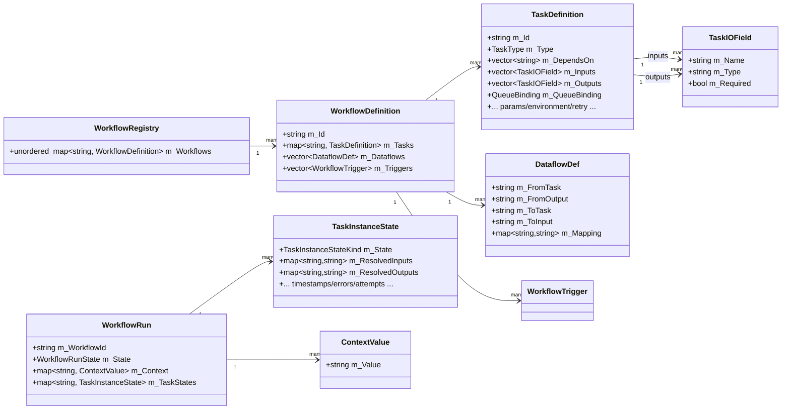
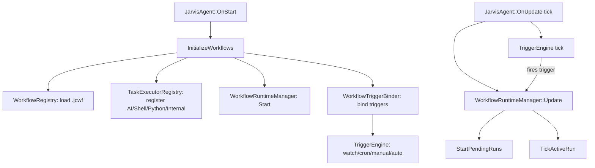
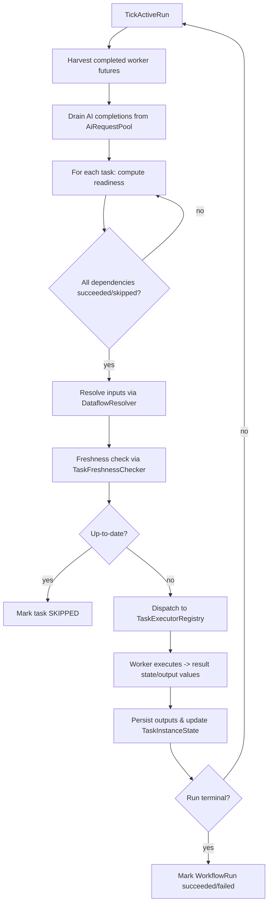
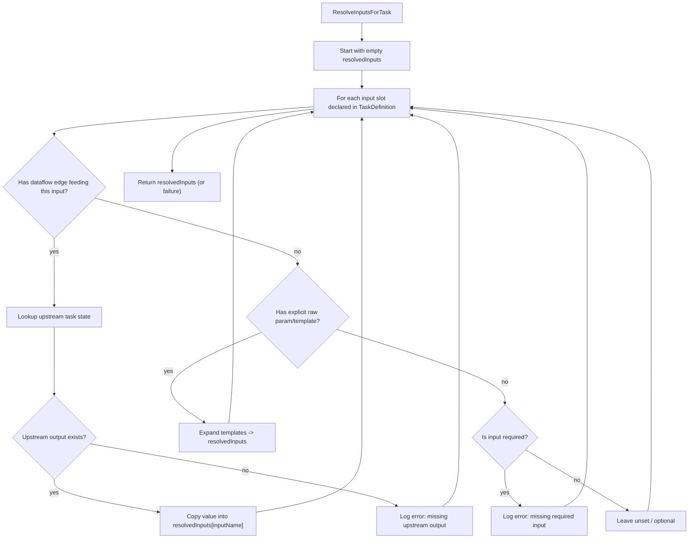
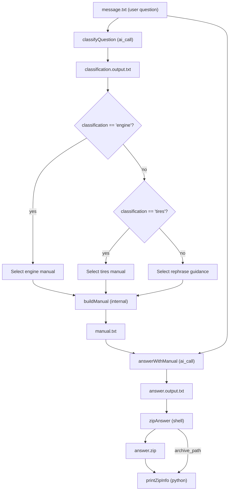
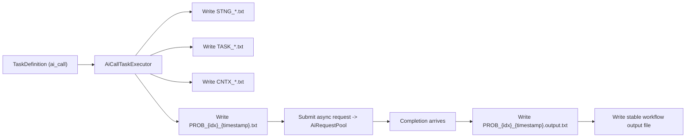

# JC Workflow Spec ↔ JarvisAgent Implementation (with Dataflow / “Data Slot” lifecycle)

This document explains how the **JC Workflow File Format™ (JCWF)** maps onto the **JarvisAgent** C++ implementation, with a focus on **data slots**, **dataflow**, and how values move through the runtime pipeline.

---

## 1) Core concepts from the JCWF spec

### 1.1 Workflow / Task / Dependency / Trigger (recap)
JCWF describes a **workflow** as a graph of **tasks**, optionally started by **triggers**, and executed under dependency + freshness rules.

The spec also introduces two “data” concepts that matter for pipelines:

- **Data Slot**: a *named input or output field* associated with a task (e.g., `zipAnswer.archive_path`).  
- **Context / State**: a *key-value store* that persists data across tasks within a workflow run.

---

## 2) Mapping: spec concepts → JarvisAgent types/classes

| Spec concept | JarvisAgent representation |
|---|---|
| Workflow definition (static) | `WorkflowDefinition` (loaded & stored in `WorkflowRegistry`) |
| Task definition (static) | `TaskDefinition` (inside `WorkflowDefinition::m_Tasks`) |
| Data slot declaration (static) | `TaskIOField` (input/output slot type + required flag) |
| Dataflow wiring (static) | `DataflowDef` (connects `from_task.output` → `to_task.input`) |
| Workflow run (runtime) | `WorkflowRun` (run-level context + per-task runtime states) |
| Task state (runtime) | `TaskInstanceState` (status + resolved input/output values + timestamps) |
| Resolve per-task inputs | `DataflowResolver` |
| Freshness / up-to-date decision | `TaskFreshnessChecker` |
| Dispatch/advance a run | `WorkflowRuntimeManager` (plus orchestration helpers) |
| Execute a task by type | `TaskExecutorRegistry` + executors (`AiCallTaskExecutor`, `ShellTaskExecutor`, `PythonTaskExecutor`, `InternalTaskExecutor`) |
| Bind triggers to runtime | `WorkflowTriggerBinder` + `TriggerEngine` |
| App lifecycle hook | `JarvisAgent::InitializeWorkflows()` (loads, binds, starts runtime) |

---

## 3) “Data Slot” lifecycle, end-to-end

### 3.1 What “data” looks like at runtime
In practice, JarvisAgent largely treats values as **strings** as they travel between tasks:

- **Static slot schema**: a slot is declared as a `TaskIOField` (name + type + required).
- **Runtime values**: once resolved, values are stored in `TaskInstanceState` as resolved inputs/outputs (string-like values) and then become available to downstream tasks through `DataflowResolver`.

### 3.2 Mermaid: data structure overview (static + runtime)

---

## 4) Execution pipeline: from file → run → task execution

### 4.1 High-level runtime flow
At startup, `JarvisAgent` initializes the workflow system (loads workflows, registers executors, binds triggers, starts runtime ticking).  
The runtime then advances workflow runs in a non-blocking, tick-based manner.

### 4.2 TickActiveRun (what happens inside a run)

---

## 5) The “dataflow” resolution step (where `data` really moves)

### 5.1 What DataflowResolver does
Conceptually, `DataflowResolver` computes a task’s resolved inputs by combining:

1. **Explicit declared inputs** on the task definition
2. **Dataflow edges** (upstream `task.output` → this `task.input`)
3. (Optionally) **template expansion** (if your workflow uses templates)

It also validates that required inputs exist and logs errors when resolution fails.

### 5.2 Mermaid: “resolve inputs” decision graph

---

## 6) Example: AI Car Maintenance Pipeline (straight pipeline + one dataflow edge)

The AI car maintenance example is a straight pipeline (AI → internal → AI → shell → python), with a **dataflow** wiring from the shell task output into the python task input.

In this workflow:
- `classifyQuestion` reads the user question (PROB source) and produces `classification.output.txt`.
- `buildManual` reads that classification output and writes `manual.txt`.
- `answerWithManual` uses `manual.txt` (context) + the original question to generate `answer.output.txt`.
- `zipAnswer` packages the answer into `answer.zip`.
- `printZipInfo` receives the `answer.zip` path via **dataflow** (`zipAnswer.archive_path → printZipInfo.filename`) and calls a Python function to print file info.

---

## 7) AI tasks and “queue artifacts” (STNG / TASK / CNTX / PROB)

AI-call tasks generate a set of files in the **queue** directory per task run. This is the same “file transparency” pattern used in `aiZipDemo`:

- The engine writes **STNG**, **TASK**, **CNTX** and a uniquely named **PROB** file per request.
- The AI response is written as a corresponding `PROB_...output...` file.
- The workflow-level output file (e.g. `classification.output.txt`, `answer.output.txt`) is the stable “product” that downstream tasks depend on via freshness rules.

---

## 8) About the “data.data type” wording

In JCWF terms, the “data” that flows between tasks is best thought of as:

- **Data slots**: named input/output fields (declared by `TaskIOField`)
- **Dataflow edges**: wiring that copies one task’s output slot into another task’s input slot (`DataflowDef`)
- **Runtime values**: the resolved string values stored on `TaskInstanceState` and optionally in the run-level `WorkflowRun` context map

If you meant a *specific C++ type literally named* `data` or `Data`, that type would need to be referenced directly (it does not appear as a named type in the high-level workflow types summary).

---

## 9) Practical tips (authoring workflows so dataflow stays clear)

- Prefer **one output file per stage** as the stable artifact for freshness (`*.output.txt`, `*.output.md`, `*.zip`, etc.).
- Use **dataflow** for “parameter passing” (e.g. file path of produced artifact) instead of duplicating paths in multiple tasks.
- When debugging “why did this run again?”, check:
  - missing outputs
  - any input timestamp newer than outputs
  - or an upstream task re-ran and updated its outputs, forcing downstream tasks to be stale.

---

## Appendix A: Pointers to existing docs in this repo

- **JarvisAgent Architecture** (`architecture.md`)
- **AI Zip Demo workflow doc** (`aiZipDemoWorkflow.md`)
- **AI Car Maintenance workflow doc** (`aiCarMaintenancePipeline.md`)
- **Combined C++ documentation** (`combinedDocumentation.md`)
