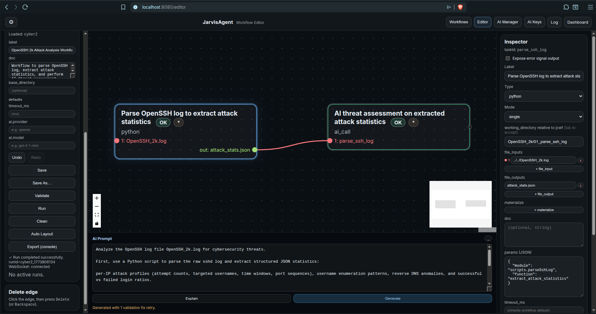

# E2E Example: OpenSSH Log Cyber Threat Analysis (`cyber2`)



This document records the end-to-end generation and execution of the `cyber2` workflow
on 2026-03-17. Every artifact shown below was produced by JarvisAgent without manual
editing.

---

## 1. User Prompt

The following prompt was entered in the Dashboard's "Generate" field:

```
Analyze the OpenSSH log file OpenSSH_2k.log for cybersecurity threats.

First, use a Python script to parse the raw sshd log and extract structured JSON statistics:

per-IP attack profiles (attempt counts, targeted usernames, time windows, port sequences),
username enumeration patterns, reverse DNS anomalies, and successful vs failed login ratios.

Then send those statistics to an AI for a deep threat assessment — classify each attacker IP
by attack type (brute force, dictionary attack, credential stuffing), rank by severity,
flag any suspicious successful logins that may indicate compromise, and recommend specific
mitigations (fail2ban rules, firewall blocks, SSH hardening). Output the final report as Markdown.
```

## 2. Input Data

The input file `workflows/OpenSSH_2k.log` (220 KB, 2000 lines) contains raw sshd log
entries from a host named `LabSZ`. Sample lines:

```
Dec 10 06:55:46 LabSZ sshd[24200]: reverse mapping checking getaddrinfo for ns.marryaldkfaczcz.com [173.234.31.186] failed - POSSIBLE BREAK-IN ATTEMPT!
Dec 10 06:55:46 LabSZ sshd[24200]: Invalid user webmaster from 173.234.31.186
Dec 10 06:55:46 LabSZ sshd[24200]: input_userauth_request: invalid user webmaster [preauth]
Dec 10 06:55:46 LabSZ sshd[24200]: pam_unix(sshd:auth): check pass; user unknown
Dec 10 06:55:46 LabSZ sshd[24200]: pam_unix(sshd:auth): authentication failure; logname= uid=0 euid=0 tty=ssh ruser= rhost=173.234.31.186
Dec 10 06:55:48 LabSZ sshd[24200]: Failed password for invalid user webmaster from 173.234.31.186 port 38926 ssh2
Dec 10 06:55:48 LabSZ sshd[24200]: Connection closed by 173.234.31.186 [preauth]
Dec 10 07:02:47 LabSZ sshd[24203]: Connection closed by 212.47.254.145 [preauth]
Dec 10 07:07:38 LabSZ sshd[24206]: Invalid user test9 from 52.80.34.196
```

---

## 3. Generation Pipeline (5 Stages)

JarvisAgent generates a JCWF through a multi-stage AI pipeline. Each stage produces
queue folder artifacts (STNG/TASK/CNTX/PROB files).

### Stage 1 — Decompose

The user prompt is sent to the AI with the full JCWF generation guide, the script
registry (16 registered scripts), and a **workflow file inventory** as context.

The file inventory told the AI which files already exist on disk:

```
--- Workflow File Inventory (paths relative to workflows/) ---
These files already exist on disk. Use them in file_inputs when appropriate.
- OpenSSH_2k.log
```

**STNG** (settings):
```
Be succinct. No embellishments. No preamble. No closing remarks.
Output ONLY the structured task breakdown — nothing else.
```

**TASK** (instructions):
```
Produce a structured task breakdown from the user's request.
For each task you MUST specify:
- task_id (short slug)
- type (shell | ai_call | python | internal)
- label
- working_directory (ai_call: '../queue/<wfId>/<NN>_<taskId>', shell: '<wfId>/<NN>_<taskId>')
- depends_on list
- expose_error_signal (true/false)
- For python: module (MUST start with 'scripts.'), function name, file_inputs, file_outputs.
  The runtime calls function(**kwargs, context=dict) — NOT via CLI.
...
```

**AI output** — a 2-task breakdown:

| Task ID | Type | Purpose |
|---------|------|---------|
| `parse_ssh_log` | python | Parse the log, output `attack_stats.json` |
| `ai_threat_assessment` | ai_call | Classify IPs, rank severity, recommend mitigations |

The AI correctly chose:
- Module `scripts.parseSshLog` with function `extract_attack_statistics`
- `file_inputs: ["OpenSSH_2k.log"]` (bare filename, relative to working_directory)
- `cntx_files: ["../../../workflows/OpenSSH_2k/01_parse_ssh_log/attack_stats.json"]` (3 levels up from queue to root)

### Stage 2 — Generate JCWF

The decomposition is fed back as context. The AI produces the complete JCWF JSON.

**STNG:**
```
Output ONLY valid JSON. No markdown fences. No explanations. No comments.
The output MUST parse as a complete JCWF file.
```

**TASK** (key rules):
```
- python params.module MUST start with 'scripts.'
- ai_call cntx_files crossing from queue to workflows:
  use '../../../workflows/<pythonWorkDir>/<file>' (3 levels up)
- file_inputs values are bare filenames relative to working_directory.
  NEVER prefix with the working_directory path — that doubles the path at runtime.
```

The AI produced a valid JCWF with `file_inputs: ["OpenSSH_2k.log"]`.

### Stage 3 — Generate Python Script

The JCWF and user request are sent as context. The AI generates `scripts/parseSshLog.py`.

**STNG:**
```
Output ONLY the raw script file content. No markdown fences. No explanations.
No introductory or closing commentary. The output must be a valid, runnable script.
```

**TASK:**
```
Generate a Python script for 'scripts/parseSshLog.py'.
Rules:
- First line MUST be: #!/usr/bin/env python3
- Second line MUST be: # @jarvis-script
- The runtime calls the function programmatically:
  module.function(**kwargs, context=dict). Do NOT use sys.argv, argparse, or main().
- The function name MUST match the 'function' field in the JCWF params.
- Accept `context=None` and `**kwargs` as parameters.
- Read file inputs via context['_file_input_0'], context['_file_input_1'], etc.
- Get working directory via context['_task_working_directory'].
- Write output files to the working directory using os.path.join().
- Output ONLY the script. Nothing else.
```

The AI produced a 173-line script with:
- Correct function signature: `def extract_attack_statistics(context=None, **kwargs)`
- File input via `context['_file_input_0']`
- Working directory via `context['_task_working_directory']`
- Regex-based parsing of `Failed password`, `Accepted password`, `Invalid user`, and
  reverse DNS failure lines
- Per-IP profile aggregation, username enumeration pattern detection, time window
  calculation
- JSON output to `attack_stats.json`

### Stage 4 — Validate

The validator ran and found one warning:

```
WARNING [file_input_unreachable]: file_inputs[0] 'OpenSSH_2k.log' not found on disk
  and no upstream task produces it
  (path: $.tasks.parse_ssh_log.file_inputs[0]) (task: parse_ssh_log)
  FIX: File 'OpenSSH_2k.log' exists at 'OpenSSH_2k.log' (relative to workflows/).
       Change file_inputs to reference the correct relative path from working_directory.
  CONTEXT: Resolved path: OpenSSH_2k/01_parse_ssh_log/OpenSSH_2k.log
```

The validator checked the path by resolving `file_inputs[0]` relative to
`working_directory` (`OpenSSH_2k/01_parse_ssh_log`) against the workflow base directory
(`workflows/`):

```
absoluteCheckPath = workflows/OpenSSH_2k/01_parse_ssh_log/OpenSSH_2k.log → does not exist
```

The file actually lives at `workflows/OpenSSH_2k.log`. The validator used the
`WorkflowFileIndex` to find the file by basename and suggested a fix. No errors were
found — only this warning — so the pipeline proceeded to the fix stage.

### Stage 5 — Fix

The warning and the current JCWF were sent to a fix AI:

**STNG:**
```
You are a JCWF code fixer. Output ONLY valid JSON — no markdown fences, no explanations,
no introductory or closing commentary. Fix all validation errors AND warnings while
preserving the workflow's intended behavior.
```

**TASK:**
```
The JCWF JSON below has validation issues. Fix ALL errors AND warnings, then output
the corrected JCWF JSON. Output ONLY the fixed JSON, nothing else.

Validation issues:
WARNING [file_input_unreachable]: file_inputs[0] 'OpenSSH_2k.log' not found on disk
  and no upstream task produces it (path: $.tasks.parse_ssh_log.file_inputs[0])
  (task: parse_ssh_log)
  FIX: File 'OpenSSH_2k.log' exists at 'OpenSSH_2k.log' (relative to workflows/).
       Change file_inputs to reference the correct relative path from working_directory.
  CONTEXT: Resolved path: OpenSSH_2k/01_parse_ssh_log/OpenSSH_2k.log
```

The fix AI changed `file_inputs` from `["OpenSSH_2k.log"]` to `["../../OpenSSH_2k.log"]`.

Re-validation confirmed:

```
absoluteCheckPath = workflows/OpenSSH_2k.log → exists on disk ✓
```

The status line in the editor reads: **"Generated with 1 validation fix retry."**

---

## 4. Final JCWF

```json
{
  "version": "1.0",
  "id": "cyber2",
  "label": "OpenSSH 2k Attack Analysis Workflow",
  "doc": "Workflow to parse OpenSSH log, extract attack statistics, and perform AI threat assessment.",
  "tasks": {
    "parse_ssh_log": {
      "id": "parse_ssh_log",
      "type": "python",
      "label": "Parse OpenSSH log to extract attack statistics",
      "working_directory": "OpenSSH_2k/01_parse_ssh_log",
      "depends_on": [],
      "expose_error_signal": false,
      "params": {
        "module": "scripts.parseSshLog",
        "function": "extract_attack_statistics"
      },
      "file_inputs": ["../../OpenSSH_2k.log"],
      "file_outputs": ["attack_stats.json"]
    },
    "ai_threat_assessment": {
      "id": "ai_threat_assessment",
      "type": "ai_call",
      "label": "AI threat assessment on extracted attack statistics",
      "working_directory": "../queue/OpenSSH_2k/02_ai_threat_assessment",
      "depends_on": ["parse_ssh_log"],
      "expose_error_signal": false,
      "queue_binding": {
        "stng_files": [
          {
            "path": "STNG_threat_assessment.txt",
            "content": "Classify attacker IPs by attack type, rank severity, flag suspicious successful logins, and recommend mitigations. No markdown fences, no explanations."
          }
        ],
        "task_files": [
          {
            "path": "TASK_threat_assessment.txt",
            "content": "Analyze the JSON-formatted SSH attack statistics and produce a detailed Markdown report with classifications and mitigation recommendations."
          }
        ],
        "cntx_files": [
          "../../../workflows/OpenSSH_2k/01_parse_ssh_log/attack_stats.json"
        ],
        "prob_files": [
          {
            "path": "PROB_threat_assessment.txt",
            "content": "Based on the extracted attack statistics, classify each IP as brute force, dictionary attack, or credential stuffing, rank by threat severity, flag suspicious successful logins, and recommend fail2ban, firewall, and SSH hardening mitigations."
          }
        ]
      }
    }
  }
}
```

### Workflow graph

```
[parse_ssh_log]          [ai_threat_assessment]
  type: python      ───>   type: ai_call
  in: OpenSSH_2k.log       in: attack_stats.json (via cntx_files)
  out: attack_stats.json   out: PROB_threat_assessment.output.txt
```

---

## 5. Node 1: `parse_ssh_log` (Python)

### Execution

The C++ `PythonEngine` resolved paths:

```
working_directory: workflows/OpenSSH_2k/01_parse_ssh_log  (created at runtime)
file_inputs[0]:   workflows/OpenSSH_2k.log                (resolved from ../../OpenSSH_2k.log)
```

It called `scripts.parseSshLog.extract_attack_statistics(context=dict)` with:

```python
context = {
    "_file_input_0": "/home/beaumanvienna/dev/jarvisAgent/workflows/OpenSSH_2k.log",
    "_task_working_directory": "/home/beaumanvienna/dev/jarvisAgent/workflows/OpenSSH_2k/01_parse_ssh_log",
    "_task_id": "parse_ssh_log"
}
```

Execution completed in under 1 second (20:55:34.956 to 20:55:34.979).

### Output: `attack_stats.json`

The script parsed 2000 log lines and extracted profiles for 24 unique source IPs.
Summary of key findings:

| IP | Attempts | Failed | Accepted | Top Target | Notes |
|----|----------|--------|----------|------------|-------|
| 183.62.140.253 | 286 | 286 | 0 | root (276) | Highest volume attacker. 614s burst. |
| 187.141.143.180 | 80 | 80 | 0 | root (46) | Broad username enumeration (28 distinct usernames). |
| 103.99.0.122 | 46 | 46 | 0 | admin (10) | 6804s time window. Wide port spread. |
| 112.95.230.3 | 26 | 26 | 0 | root (24) | 59s concentrated burst. |
| 185.190.58.151 | 17 | 17 | 0 | admin (15) | 301s window. |
| 5.188.10.180 | 17 | 17 | 0 | admin (6) | Mixed targets: admin, default, guest. |
| 119.137.62.142 | 1 | 0 | **1** | fztu | **Successful login.** |

The JSON also includes:
- `username_enumeration_patterns` — usernames targeted by >3 IPs or >10 attempts
  (flagged: `root`, `admin`, `support`, `test`)
- `reverse_dns_anomalies` — IPs with failed reverse DNS (none in parsed subset due
  to regex matching on IP field position in the reverse-mapping line)
- Per-IP `time_window` with start/end timestamps and duration in seconds
- Per-IP `ports` list (sorted)

---

## 6. Node 2: `ai_threat_assessment` (ai_call)

### Queue folder structure

The runtime materialized 4 files into `queue/OpenSSH_2k/02_ai_threat_assessment/`:

| File | Source | Role |
|------|--------|------|
| `STNG_threat_assessment.txt` | Inline content from JCWF | AI personality/constraints |
| `TASK_threat_assessment.txt` | Inline content from JCWF | Task instructions |
| `CNTX_attack_stats.json` | Copied from `workflows/OpenSSH_2k/01_parse_ssh_log/attack_stats.json` | Context data (31 KB) |
| `PROB_threat_assessment.txt` | Inline content from JCWF | Problem statement (triggers AI query) |

The `cntx_files` path `../../../workflows/OpenSSH_2k/01_parse_ssh_log/attack_stats.json`
resolved correctly:

```
queue/OpenSSH_2k/02_ai_threat_assessment/  (3 levels up)
  → jarvisAgent root
  → workflows/OpenSSH_2k/01_parse_ssh_log/attack_stats.json
```

The runtime copied it as `CNTX_attack_stats.json` in the queue folder.

The full AI prompt was composed as: `STNG + CNTX + TASK + PROB`.

### AI model

`gpt-4.1-mini-2025-04-14`, 11484 input tokens, 1653 output tokens.

### Output: `PROB_threat_assessment.output.txt`

The AI produced a structured Markdown report with 4 sections:

**Section 1 — Attack Classification per IP** (24 IPs classified):
- 23 IPs classified as **Brute Force**
- 1 IP (`119.137.62.142`) flagged as **Suspicious login** (1 accepted password for
  user `fztu`)

**Section 2 — Threat Severity Ranking**:

| Rank | IP | Severity | Reason |
|------|----|----------|--------|
| 1 | 183.62.140.253 | Critical | 286 failed attempts, mass scans targeting root |
| 2 | 187.141.143.180 | High | 80 attempts, broad username targeting |
| 3 | 103.99.0.122 | High | 46 attempts over long time window |
| 4 | 112.95.230.3 | High | 26 attempts targeting root in 59s burst |
| 5 | 185.190.58.151 | Medium | 17 attempts focusing on admin |
| 6 | 5.188.10.180 | Medium | 17 attempts targeting admin, default, guest |

**Section 3 — Suspicious Successful Logins**:
- `119.137.62.142` / user `fztu` / 1 attempt / 1 accepted — flagged for investigation

**Section 4 — Mitigation Recommendations**:
- Enable `fail2ban` with tailored SSH rules (3-5 attempts in 60s)
- Firewall bans for high-severity IPs (183.62.140.253, 187.141.143.180, 103.99.0.122)
- SSH hardening: disable root login, enforce key-based auth, change default port, enable 2FA
- Monitor the suspicious successful login from 119.137.62.142
- Review heavily targeted accounts (root, admin, support)

---

## 7. Prompt vs. Result Assessment

The user prompt requested 7 specific deliverables. Coverage:

| Requested | Delivered | Notes |
|-----------|----------|-------|
| Per-IP attack profiles (attempt counts, targeted usernames, time windows, port sequences) | Yes | All 4 sub-fields present in `attack_stats.json` for every IP |
| Username enumeration patterns | Yes | `username_enumeration_patterns` section in JSON; `root`, `admin`, `support`, `test` flagged |
| Reverse DNS anomalies | Partial | Field present but regex did not capture all reverse-DNS lines (IP/hostname group order) |
| Successful vs failed login ratios | Yes | `accepted_passwords` and `failed_passwords` per IP |
| Classify each IP by attack type | Yes | 23 brute force, 1 suspicious login. No credential stuffing or dictionary attack differentiation |
| Rank by severity | Yes | 12-rank table from Critical to Low |
| Flag suspicious successful logins | Yes | 119.137.62.142 / fztu flagged |
| Recommend mitigations (fail2ban, firewall, SSH hardening) | Yes | All three categories covered with specific recommendations |
| Output as Markdown | Yes | Structured report with tables and sections |

### Accuracy

The attack classifications are consistent with the data:
- 183.62.140.253 (286 attempts, root-focused) is correctly ranked Critical.
- 119.137.62.142 is the only IP with `accepted_passwords > 0` and is correctly flagged.
- The severity ranking correlates with attempt volume and target breadth.

The AI did not distinguish between "dictionary attack" and "brute force" — it classified
all failed-password IPs uniformly as brute force. This is reasonable given the data: most
IPs target common usernames (root, admin) without evidence of dictionary-specific patterns
(e.g., alphabetically ordered wordlists).

### Limitation

The reverse DNS anomaly count in the JSON is zero for all IPs. The regex pattern in the
generated script captured the IP and hostname fields in reversed positions compared to the
actual log format. The log line format is:

```
reverse mapping checking getaddrinfo for <hostname> [<IP>] failed
```

The script regex expected `<IP> [<hostname>]`. This is a minor parsing bug in the
AI-generated script that does not affect the overall threat assessment (the AI worked
from the remaining data fields).

---

## 8. File Layout After Execution

```
workflows/
  cyber2.jcwf                                          # JCWF definition
  OpenSSH_2k.log                                       # Input log (pre-existing)
  OpenSSH_2k/
    01_parse_ssh_log/
      attack_stats.json                                # Python output (31 KB)

queue/
  _ai_jcwf_service/
    gen_1_decompose/   STNG + TASK + CNTX + PROB       # Stage 1
    gen_1_generate/    STNG + TASK + CNTX + PROB       # Stage 2
    gen_1_script_0/    STNG + TASK + CNTX + PROB       # Stage 3
    gen_1_fix/         STNG + TASK + CNTX + PROB       # Stage 5
  OpenSSH_2k/
    02_ai_threat_assessment/
      STNG_threat_assessment.txt                       # AI settings
      TASK_threat_assessment.txt                       # AI task instructions
      CNTX_attack_stats.json                           # Copied from python output
      PROB_threat_assessment.txt                       # Problem statement
      PROB_threat_assessment.output.txt                # AI report (8.2 KB)

scripts/
  parseSshLog.py                                       # AI-generated script (7.4 KB)
```

---

## 9. Timeline

| Time | Event |
|------|-------|
| 20:53:14 | JarvisAgent started. WorkflowFileIndex indexed 1 file (`OpenSSH_2k.log`). |
| 20:54:02 | Generation triggered. Stage 1 (decompose) dispatched. |
| 20:54:13 | Stage 2 (generate JCWF) dispatched. |
| 20:54:27 | Stage 3 (generate Python script) dispatched. |
| 20:55:04 | Stage 4 (validate). 1 warning: `file_input_unreachable`. |
| 20:55:04 | Stage 5 (fix) dispatched. |
| 20:55:12 | Fix AI returned corrected JCWF (`../../OpenSSH_2k.log`). Re-validation passed. |
| 20:55:13 | Generation complete. JCWF and script delivered to editor. |
| 20:55:28 | Script written to `scripts/parseSshLog.py`. ScriptRegistry registered it. |
| 20:55:34 | User clicked Run. Workflow `cyber2` started. |
| 20:55:34 | `parse_ssh_log` executed (23ms). `attack_stats.json` written. |
| 20:55:34 | `ai_threat_assessment` dispatched. Queue folder materialized. |
| 20:55:53 | AI response received. Report written. |
| 20:55:53 | Workflow run `cyber2_1773806134` completed. |
