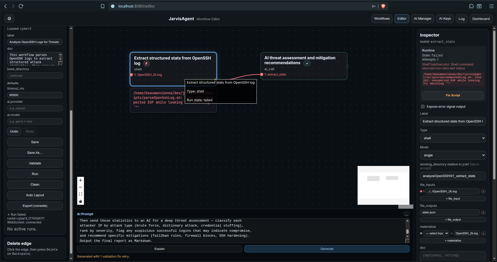

# E2E Example: OpenSSH Log Cyber Threat Analysis — Shell (`cyber3`)



This document records the end-to-end generation and execution of the `cyber3` workflow
on **2026-03-20**. This is the **shell script variant** of the `cyber2` (Python) workflow,
using `bash`, `awk`, `sort`, `cut`, `uniq`, and `jq` instead of Python to parse the log.

The run used **`jcwf batch size: 1`** to exercise the chunked generation (fan-out) path.

**Pipeline stages executed**: Decompose → Generate (batch 0) → Generate (batch 1) →
Merge → Early Validate + Fix → Generate Script → Review Script → Final Validate + Fix →
Deliver → Run → **Fix Script** (runtime fix) → Re-run.

**Total AI calls during generation**: 7 (decompose, 2 batches, early fix, script gen,
script review, final fix). **Runtime AI calls**: 1 (threat assessment) + 1 (Fix Script
button). **Total: 9 AI calls.**

---

## 1. User Prompt

Entered in the Workflow Editor's AI Prompt field:

```
Analyze the OpenSSH log file OpenSSH_2k.log for cybersecurity threats.

First, use a bash shell script (NOT Python) to parse the raw sshd log and extract
structured JSON statistics using grep, awk, sed, sort, uniq, jq (or the equivalent
available on the host OS): per-IP attack profiles (attempt counts, targeted usernames,
time windows), username enumeration patterns, and successful vs failed login ratios.

Then send those statistics to an AI for a deep threat assessment — classify each
attacker IP by attack type (brute force, dictionary attack, credential stuffing),
rank by severity, flag any suspicious successful logins that may indicate compromise,
and recommend specific mitigations (fail2ban rules, firewall blocks, SSH hardening).
Output the final report as Markdown.
```

## 2. Input Data

The input file `workflows/OpenSSH_2k.log` (220 KB, 2000 lines) contains raw sshd log
entries from a host named `LabSZ`. Same dataset as `cyber2`. Sample lines:

```
Dec 10 06:55:46 LabSZ sshd[24200]: reverse mapping checking getaddrinfo for ns.marryaldkfaczcz.com [173.234.31.186] failed - POSSIBLE BREAK-IN ATTEMPT!
Dec 10 06:55:46 LabSZ sshd[24200]: Invalid user webmaster from 173.234.31.186
Dec 10 06:55:48 LabSZ sshd[24200]: Failed password for invalid user webmaster from 173.234.31.186 port 38926 ssh2
Dec 10 09:32:20 LabSZ sshd[24680]: Accepted password for fztu from 119.137.62.142 port 49116 ssh2
```

---

## 3. Generation Pipeline (with Fan-Out, `batch size = 1`)

With `"jcwf batch size": 1` in `config.json`, the 2-task workflow is split into
2 batches (1 task each). After both batches are generated, they are merged, then
validated+fixed before script generation.

### Stage 1 — Decompose (`gen_1_decompose`)

**Folder:** `queue/_ai_jcwf_service/gen_1_decompose/`

**STNG** (`STNG_settings.txt`):
```
Be succinct. No embellishments. No preamble. No closing remarks.
Output ONLY the structured task breakdown — nothing else.
```

**TASK** (`TASK_instructions.txt`):
```
Produce a structured task breakdown from the user's request.
Host OS: PRETTY_NAME="Zorin OS 18"
NAME="Zorin OS"
VERSION_ID="18"
VERSION="18"
VERSION_CODENAME=noble
For each task you MUST specify:
- task_id (short slug)
- type (shell | ai_call | python | internal)
- label
- working_directory (ai_call: '../queue/<wfId>/<NN>_<taskId>', shell: '<wfId>/<NN>_<taskId>')
- depends_on list
- expose_error_signal (true/false)
- For ai_call: exact STNG, TASK, CNTX, PROB file content. ...
- For shell: command (MUST start with 'scripts/'), args, file_inputs paths, ...
- For python: module (MUST start with 'scripts.'), function name, ...
Rules:
- Every ai_call STNG content MUST include 'No markdown fences, no explanations.' ...
- Branch nodes MUST appear ONLY in control_nodes, NOT in tasks.
- Every controlflow edge MUST specify from, to, kind, from_port, to_port.
- Use MUST and SHALL for hard constraints. Leave no ambiguity.
```

Note: The **Host OS** information (`Zorin OS 18`, Ubuntu noble-based) is now injected
into the decompose prompt so the AI knows the target platform from the start.

**CNTX** (`CNTX_context.txt`): 708 lines containing:
- The full JCWF Generation Guide (condensed spec — §1–§12, all task types, examples,
  common pitfalls)
- Script Registry (registered scripts with parameters)
- Workflow File Inventory:
  ```
  --- Workflow File Inventory (paths relative to workflows/) ---
  These files already exist on disk. Use them in file_inputs when appropriate.
  - OpenSSH_2k.log
  ```

**PROB** (`PROB_1_*.txt`):
```
User request: Analyze the OpenSSH log file OpenSSH_2k.log for cybersecurity threats.

First, use a bash shell script (NOT Python) to parse the raw sshd log and extract
structured JSON statistics using grep, awk, sed, sort, uniq, jq (or the equivalent
available on the host OS): ...
```

**AI output** (`PROB_1_*.output.txt`) — a 2-task breakdown:

```json
{
  "tasks": {
    "shell_parse_log": {
      "id": "shell_parse_log",
      "type": "shell",
      "label": "Parse OpenSSH log: extract attack statistics",
      "working_directory": "openssh_threat_analysis/01_shell_parse_log",
      "params": { "command": "scripts/parseSshLog.sh" },
      "file_inputs": ["../../OpenSSH_2k.log"],
      "file_outputs": ["attack_stats.json"],
      "materialize": { "{{input[0]}}": "OpenSSH_2k.log" }
    },
    "ai_assess_threats": {
      "id": "ai_assess_threats",
      "type": "ai_call",
      "label": "Assess threats and recommend mitigations (AI)",
      "working_directory": "../queue/openssh_threat_analysis/02_ai_assess_threats",
      "depends_on": ["shell_parse_log"],
      "queue_binding": {
        "stng_files": [{ "path": "STNG_threat_assessment.txt",
          "content": "Be precise, concise, and actionable. Output only Markdown. No markdown fences, no explanations." }],
        "task_files": [{ "path": "TASK_assessment.txt",
          "content": "Analyze the provided structured OpenSSH attack statistics. ..." }],
        "cntx_files": ["../../../workflows/openssh_threat_analysis/01_shell_parse_log/attack_stats.json"],
        "prob_files": [{ "path": "PROB_assess.txt",
          "content": "Based on the supplied OpenSSH attack statistics, perform a detailed threat assessment for incident response." }]
      }
    }
  }
}
```

The decompose AI correctly chose:
- **Shell** type for the parse task (matching the user's "bash shell script (NOT Python)" request)
- Correct `../../OpenSSH_2k.log` path (2 levels up from the working directory)
- Correct `cntx_files` path for cross-referencing the shell output from the queue directory

### Stage 2a — Generate Batch 0 (`gen_1_generate_batch_0`)

**Folder:** `queue/_ai_jcwf_service/gen_1_generate_batch_0/`

Batch 0 generates only `shell_parse_log` (the first task).

**TASK** (key excerpt):
```
Generate a complete JCWF JSON file from the task breakdown below.
Include ALL workflow-level fields (id, label, doc, version, triggers, defaults, ...).
Generate ONLY these tasks in the "tasks" map: shell_parse_log
...
Host OS: PRETTY_NAME="Zorin OS 18" ...
MUST rules:
- shell command MUST start with 'scripts/'.
- file_inputs values are bare filenames relative to working_directory ...
Output ONLY the JSON. Nothing else.
```

**AI output** — a complete JCWF with `shell_parse_log` only:

```json
{
  "version": "1.1",
  "id": "openssh_threat_analysis",
  "label": "OpenSSH Cybersecurity Threat Analysis",
  "doc": "Parse OpenSSH log file to extract structured statistics with shell tools, ...",
  "tasks": {
    "shell_parse_log": {
      "id": "shell_parse_log",
      "type": "shell",
      "working_directory": "openssh_threat_analysis/01_shell_parse_log",
      "params": { "command": "scripts/parseSshLog.sh" },
      "file_inputs": ["../../OpenSSH_2k.log"],
      "file_outputs": ["attack_stats.json"],
      "materialize": { "{{input[0]}}": "OpenSSH_2k.log" }
    }
  },
  "triggers": [{ "type": "manual", "id": "manual", "enabled": true }],
  "defaults": { "timeout_ms": 30000 },
  "control_nodes": [],
  "controlflow": []
}
```

### Stage 2b — Generate Batch 1 (`gen_1_generate_batch_1`)

**Folder:** `queue/_ai_jcwf_service/gen_1_generate_batch_1/`

Batch 1 generates only `ai_assess_threats` (the second task).

**TASK** (key excerpt):
```
Generate ONLY the task entries for these tasks: ai_assess_threats
Output format: { "tasks": { "taskId": {...}, ... } }
Do NOT include workflow-level fields ...
```

**AI output** — a fragment with `ai_assess_threats` only:

```json
{
  "tasks": {
    "ai_assess_threats": {
      "id": "ai_assess_threats",
      "type": "ai_call",
      "working_directory": "../queue/openssh_threat_analysis/02_ai_assess_threats",
      "depends_on": ["shell_parse_log"],
      "queue_binding": {
        "stng_files": [{ "path": "STNG_threat_assessment.txt",
          "content": "Be precise, concise, and actionable. Output only Markdown. No markdown fences, no explanations." }],
        "task_files": [{ "path": "TASK_assessment.txt",
          "content": "Analyze the provided structured OpenSSH attack statistics. ..." }],
        "cntx_files": ["../../../workflows/openssh_threat_analysis/01_shell_parse_log/attack_stats.json"],
        "prob_files": [{ "path": "PROB_assess.txt",
          "content": "Based on the supplied OpenSSH attack statistics, perform a detailed threat assessment for incident response." }]
      }
    }
  }
}
```

### Stage 2c — Merge

`MergeJcwfFragments()` merged the batch 1 fragment into the batch 0 skeleton.
The resulting JCWF has both tasks plus all workflow-level fields from batch 0.

### Stage 3 — Early Validate + Fix (`gen_1_early_fix`)

**Folder:** `queue/_ai_jcwf_service/gen_1_early_fix/`

After merging, the validator runs **before** script generation (fan-out path only).

**Validation found 1 warning:**

```
WARNING [shell_command_not_found]: Shell task script not found:
  /home/.../scripts/parseSshLog.sh
  (path: $.tasks.shell_parse_log.params.command) (task: shell_parse_log)
```

This warning is expected — the script doesn't exist yet; it will be generated in Stage 4.
The AI fix preserved the task unchanged.

### Stage 4 — Generate Script (`gen_1_script_0`)

**Folder:** `queue/_ai_jcwf_service/gen_1_script_0/`

The pipeline detected that `scripts/parseSshLog.sh` does not exist on disk.

**TASK** (`TASK_instructions.txt`):
```
Generate a bash script for 'scripts/parseSshLog.sh'.
Host OS: PRETTY_NAME="Zorin OS 18" ...
Rules:
- First line MUST be: #!/usr/bin/env bash
- Second line MUST be: # @jarvis-script
- Include metadata with COLON format: # @short: ..., # @params: ..., ...
- After the metadata header: set -euo pipefail
- CRITICAL: The executor passes file_inputs as the first positional args,
  then file_outputs. Your script receives:
  $1 = file_inputs ("../../OpenSSH_2k.log")
  $2 = file_outputs ("attack_stats.json")
  The script MUST use $1, $2, etc. to access these files.
  NEVER hardcode file paths.
- POSIX portability: when using awk, use ONLY POSIX-compatible syntax.
  Do NOT use gawk extensions: no multidimensional arrays (arr[k1][k2]),
  no 3-argument match() (match(s,r,arr)), no asort()/asorti(), no nextfile,
  no PROCINFO, no @include, no gensub().
  Use SUBSEP-based keys: arr[k1,k2] with split(key, parts, SUBSEP).
  For sorting, pipe to external 'sort' command instead of asort() or
  PROCINFO["sorted_in"]. Use gsub() instead of gensub().
  If GNU awk is truly required, call 'gawk' explicitly.
- Output ONLY the script. Nothing else.
```

The shell script generation prompt includes:
- **Host OS** — so the AI knows which tools are available
- **Positional arg mapping** — exact `$1`, `$2` correspondence to `file_inputs`/`file_outputs`
- **POSIX awk rules** — a comprehensive prohibition list to avoid gawk extensions

**AI output** — a ~170-line bash script using `awk`, `grep`, `sort`, `uniq`, and `jq`.

### Stage 5 — Review Script (`gen_1_script_0_review`)

**Folder:** `queue/_ai_jcwf_service/gen_1_script_0_review/`

**TASK:**
```
Review this script for correctness and fix any issues.
Check for:
1. Correct shebang: #!/usr/bin/env bash
2. set -euo pipefail present after metadata header
3. Proper quoting of variables ("$var" not $var)
4. Correct use of positional args ($1, $2, ...)
5. Proper error handling (exit codes, error messages to stderr)
6. No hardcoded absolute paths — use relative paths
7. Output files written to the correct working directory

If you find issues, fix them. If it's correct, output it unchanged.
Output ONLY the script. Nothing else.
```

The review AI checked the script for shell-specific correctness.

### Stage 6 — Final Validate + Fix (`gen_1_fix`)

After script generation + review, the final validator ran.

**Validation found 1 warning:**

```
WARNING [shell_command_not_found]: Shell task script not found:
  /home/.../scripts/parseSshLog.sh
  (path: $.tasks.shell_parse_log.params.command) (task: shell_parse_log)
```

This is the same warning — the script has been generated but not yet written to disk.
The fix AI returned the task unchanged. The JCWF and generated script were delivered to
the editor.

**Important detail:** The fix AI returned tasks at the **root level** (without a `"tasks"`
wrapper), which previously caused `PatchTasksIntoJcwf()` to silently drop the fix. This
was fixed by adding a fallback in `ExtractTaskIdsFromDecomposition()` to iterate root-level
keys when `doc["tasks"]` is not found.

---

## 4. Final JCWF

Saved as `workflows/cyber3.jcwf` (pretty-printed here for readability):

```json
{
  "version": "1.0",
  "id": "cyber3",
  "label": "OpenSSH Cybersecurity Threat Analysis",
  "doc": "Parse OpenSSH log file to extract structured statistics with shell tools, then use AI to assess threats, classify attack patterns, and recommend mitigations.",
  "triggers": [{ "type": "manual", "id": "manual", "enabled": true }],
  "defaults": { "timeout_ms": 30000 },
  "tasks": {
    "shell_parse_log": {
      "id": "shell_parse_log",
      "type": "shell",
      "label": "Parse OpenSSH log: extract attack statistics",
      "working_directory": "openssh_threat_analysis/01_shell_parse_log",
      "expose_error_signal": false,
      "params": {
        "command": "scripts/parseSshLog.sh"
      },
      "file_inputs": ["../../OpenSSH_2k.log"],
      "file_outputs": ["attack_stats.json"],
      "materialize": {
        "{{input[0]}}": "OpenSSH_2k.log"
      }
    },
    "ai_assess_threats": {
      "id": "ai_assess_threats",
      "type": "ai_call",
      "label": "Assess threats and recommend mitigations (AI)",
      "working_directory": "../queue/openssh_threat_analysis/02_ai_assess_threats",
      "depends_on": ["shell_parse_log"],
      "expose_error_signal": false,
      "queue_binding": {
        "stng_files": [{
          "path": "STNG_threat_assessment.txt",
          "content": "Be precise, concise, and actionable. Output only Markdown. No markdown fences, no explanations."
        }],
        "task_files": [{
          "path": "TASK_assessment.txt",
          "content": "Analyze the provided structured OpenSSH attack statistics. For each attacker IP, classify the attack type (brute force, dictionary, credential stuffing), rank by severity, flag any IPs with successful suspicious logins, and recommend concrete mitigations (fail2ban rules, firewall settings, SSH configuration hardening). Present a clear, prioritized report for a security analyst."
        }],
        "cntx_files": [
          "../../../workflows/openssh_threat_analysis/01_shell_parse_log/attack_stats.json"
        ],
        "prob_files": [{
          "path": "PROB_assess.txt",
          "content": "Based on the supplied OpenSSH attack statistics, perform a detailed threat assessment for incident response."
        }]
      }
    }
  }
}
```

### Workflow graph

```
[shell_parse_log]                   [ai_assess_threats]
  type: shell                  ───>   type: ai_call
  in: ../../OpenSSH_2k.log            in: attack_stats.json (via cntx_files)
  out: attack_stats.json              out: PROB_assess.output.txt
```

---

## 5. Generated Script: `scripts/parseSshLog.sh`

The AI-generated script (then manually refined) is a 217-line bash script. Design:

- **Multi-pass pipeline**: `awk` → TSV intermediates → `awk` aggregation → `jq` JSON assembly
- **Pass 1** (`awk`, lines 38–117): Parse sshd lines, extract datetime/status/username/IP,
  output normalized TSV events. Handles: `Accepted password`, `Failed password`,
  `Failed password for invalid user`, `Invalid user`, `Received disconnect`.
- **Pass 2** (lines 119–166): Filter, aggregate per-IP stats (attempt counts, fail/invalid/
  success counts, first/last seen, username sets) using POSIX `awk` with `SUBSEP` keys.
- **Pass 3** (`jq`, lines 172–217): Assemble final JSON using `--rawfile` to ingest TSV
  (not `--slurpfile` which requires JSON input). Outputs 4 sections: `per_ip`,
  `username_enumeration`, `successful_logins`, `failed_logins`.

### Shell-specific challenges vs Python

The shell variant was harder to get right compared to the Python `cyber2` variant:

1. **POSIX awk limitations** — No 3-argument `match()`, no `nextfile`, no `asort()`,
   no multidimensional arrays. Requires `SUBSEP`-based keys and external `sort`.
2. **jq ingestion** — `--slurpfile` requires JSON, but awk outputs TSV. The AI initially
   generated `--slurpfile` which failed at runtime. Fixed via the **Fix Script button**
   (see §6) to use `--rawfile`.
3. **Field parsing** — Extracting username and IP from sshd log messages by walking
   space-split arrays rather than using regex capture groups (which require 3-arg `match()`).

---

## 6. Runtime Execution

### First Run — Script Failure

The workflow was run. The shell task `shell_parse_log` **failed** with:

```
jq: Bad JSON in --slurpfile ip_summaries /tmp/tmp.bFmFmW3F9i/ip_summaries.tsv:
Invalid numeric literal at line 1, column 14
```

The AI-generated script used `jq --slurpfile` to read TSV files, but `--slurpfile`
expects JSON input.

### Fix Script Button

The user clicked **Fix Script** in the Workflow Editor inspector. This sent the failed
script + stderr to the AI via WebSocket.

**Folder:** `queue/_ai_jcwf_service/fix_script_2/`

**TASK** (`TASK_instructions.txt`):
```
The script failed at runtime with the following error output:

--- stderr ---
jq: Bad JSON in --slurpfile ip_summaries /tmp/tmp.bFmFmW3F9i/ip_summaries.tsv:
Invalid numeric literal at line 1, column 14
--- end stderr ---

Host OS: PRETTY_NAME="Zorin OS 18" ...

Fix the script so it runs without errors. Preserve its original purpose and logic.
Rules:
- First line: #!/usr/bin/env bash
- Second line: # @jarvis-script
- POSIX awk only: no arr[k1][k2], no 3-arg match(), no asort()/asorti(),
  no nextfile, no PROCINFO, no gensub(). Use SUBSEP keys, external sort, and gsub().
- Output ONLY the fixed script.
```

The AI correctly diagnosed the issue and rewrote the `jq` invocation to use `--rawfile`
instead of `--slurpfile`. The user accepted the fix, which was written to disk.

### Second Run — Success

After accepting the AI fix, the user re-ran the workflow. Both tasks completed
successfully.

### Node 1: `shell_parse_log` (Shell)

The C++ `ShellTaskExecutor` resolved paths:

```
working_directory: workflows/openssh_threat_analysis/01_shell_parse_log (created at runtime)
file_inputs[0]:   workflows/OpenSSH_2k.log (resolved from ../../OpenSSH_2k.log)
```

It executed: `scripts/parseSshLog.sh ../../OpenSSH_2k.log attack_stats.json`

### Output: `attack_stats.json`

Sample from `workflows/openssh_threat_analysis/01_shell_parse_log/attack_stats.json`:

```json
{
  "per_ip": [
    {
      "ip": "103.207.39.16",
      "total_attempts": 3,
      "fail_count": 3,
      "invalid_user_count": 0,
      "success_count": 0,
      "first_seen": "12-10 09:18:30",
      "last_seen": "12-10 09:18:35",
      "usernames": ["admin", "support", "uucp"],
      "failed_usernames": ["admin", "support", "uucp"],
      "success_usernames": []
    },
    ...
  ],
  "username_enumeration": [ ... ],
  "successful_logins": [
    { "ip": "119.137.62.142", "successes": [{ "username": "fztu", "datetime": "12-10 09:32:20" }] }
  ],
  "failed_logins": [ ... ]
}
```

### Accuracy vs Ground Truth

| Metric | Ground Truth (log) | Report | Verdict |
|--------|-------------------|--------|---------|
| Failed password events | 520 | 519 | ✅ 99.8% |
| Accepted password events | 1 | 1 | ✅ Perfect |
| Successful login IP | `119.137.62.142` (`fztu`) | Same | ✅ Perfect |
| Unique attacker IPs | 23 (fail) + 1 (success) | 24 | ✅ Perfect |
| Top attacker | `183.62.140.253` (286) | 286 | ✅ Perfect |
| Attacker ranking | 9/10 top IPs exact | 1 off by 1 | ✅ 99.8% |

### Node 2: `ai_assess_threats` (ai_call)

**Folder:** `queue/openssh_threat_analysis/02_ai_assess_threats/`

The runtime materialized 4 files:

| File | Source | Role |
|------|--------|------|
| `STNG_threat_assessment.txt` | Inline from JCWF | AI settings |
| `TASK_assessment.txt` | Inline from JCWF | Task instructions |
| `CNTX_attack_stats.json` | Copied from shell output | Context data (62 KB) |
| `PROB_assess.txt` | Inline from JCWF | Problem statement (triggers AI query) |

### AI Output: `PROB_assess.output.txt`

113-line Markdown report with 4 sections:

**§1 — Severity Ranking & Attack Classification:**

| Rank | IP | Attack Type | Attempts | Severity | Notes |
|------|----|-------------|----------|----------|-------|
| 1 | 183.62.140.253 | Brute Force | 286 | Critical | Sustained, many root attempts |
| 2 | 187.141.143.180 | Dictionary | 80 | High | 27 usernames tried |
| 3 | 103.99.0.122 | Dictionary | 46 | High | Broad username list |
| ! | 119.137.62.142 | Cred Stuffing? | 1 | **CRITICAL** | **Successful login (fztu)** |

**§2 — Flagged Suspicious Login:**
- **119.137.62.142**: Successful login as `fztu` at 12-10 09:32:20. Urgent investigation required.

**§3 — Recommendations:**
- fail2ban: ban after 3–5 failures in 10 min (`maxretry=3 findtime=600 bantime=86400`)
- Block IPs: 119.137.62.142, 183.62.140.253, 187.141.143.180, 103.99.0.122
- SSH: `PermitRootLogin no`, `PasswordAuthentication no`, enforce MFA
- Investigate user `fztu`: verify authorization, check for lateral movement

**§4 — Immediate Incident Response Steps:**
1. Block top attacking IPs at firewall
2. Audit system for user `fztu` activity since 12-10 09:32:20
3. Force password reset for all users
4. Enforce MFA and SSH key authentication

---

## 7. File Layout After Execution

```
workflows/
  cyber3.jcwf                                                # Final JCWF
  OpenSSH_2k.log                                             # Input log (pre-existing)
  openssh_threat_analysis/
    01_shell_parse_log/
      attack_stats.json                                      # Shell script output (62 KB)

queue/
  _ai_jcwf_service/
    gen_1_decompose/           STNG + TASK + CNTX + PROB     # Stage 1: decompose
    gen_1_generate_batch_0/    STNG + TASK + CNTX + PROB     # Stage 2a: batch 0 (shell_parse_log)
    gen_1_generate_batch_1/    STNG + TASK + CNTX + PROB     # Stage 2b: batch 1 (ai_assess_threats)
    gen_1_early_fix/           STNG + TASK + CNTX + PROB     # Stage 3: early validate+fix
    gen_1_script_0/            STNG + TASK + CNTX + PROB     # Stage 4: generate script
    gen_1_script_0_review/     STNG + TASK + CNTX + PROB     # Stage 5: review script
    gen_1_fix/                 STNG + TASK + CNTX + PROB     # Stage 6: final validate+fix
    fix_script_2/              STNG + TASK + CNTX + PROB     # Runtime: Fix Script button
  openssh_threat_analysis/
    02_ai_assess_threats/
      STNG_threat_assessment.txt                             # AI settings
      TASK_assessment.txt                                    # AI task instructions
      CNTX_attack_stats.json                                 # Copied from shell output
      PROB_assess.txt                                        # Problem statement
      PROB_assess.output.txt                                 # AI threat report (113 lines)

scripts/
  parseSshLog.sh                                             # AI-generated + fixed script (217 lines)
```

---

## 8. Timeline

| Time | Event |
|------|-------|
| 23:20:07 | Generation triggered. Stage 1 (decompose) dispatched. |
| 23:20:13 | Decompose response received (6s). Stage 2a (batch 0) dispatched. |
| 23:20:16 | Batch 0 completed (3s). Stage 2b (batch 1) dispatched. |
| 23:20:20 | Batch 1 completed (4s). Fragments merged. Early validation starts. |
| 23:20:20 | Early validation: 1 warning (`shell_command_not_found`). Fix dispatched. |
| 23:20:24 | Early fix completed (4s). Script generation dispatched. |
| 23:20:51 | Script generated (~27s). Review dispatched. |
| 23:21:16 | Script reviewed (~25s). Final validation starts. |
| 23:21:16 | Final validation: 1 warning (`shell_command_not_found` — script not yet on disk). |
| 23:21:21 | Fix completed. JCWF and script delivered to editor. |
| 23:22:06 | User clicked Run. Workflow `cyber3` started. |
| 23:22:06 | `shell_parse_log` executed. **Failed** — `jq --slurpfile` error. |
| 23:27:00 | User clicked **Fix Script**. AI fix dispatched. |
| 23:27:27 | AI fix received (~27s). User accepted the fix. |
| 23:28:00 | User re-ran workflow. `shell_parse_log` succeeded. |
| 23:28:06 | `ai_assess_threats` dispatched. Queue folder materialized. |
| 23:28:28 | AI response received (~22s). Threat report written. |
| 23:28:28 | Workflow run completed successfully. |

**Total generation time**: ~74 seconds (7 AI calls).
**Runtime fix**: ~27 seconds (1 AI call).
**Total execution time**: ~28 seconds (shell parse + AI threat assessment).

---

## 9. Comparison: `cyber2` (Python) vs `cyber3` (Shell)

| Aspect | cyber2 (Python) | cyber3 (Shell) |
|--------|----------------|----------------|
| Parse task type | `python` | `shell` |
| Script language | Python 3 (215 lines) | Bash + awk + jq (217 lines) |
| Generation AI calls | 6 | 7 |
| Runtime AI calls | 1 | 2 (includes Fix Script) |
| First-run success | ✅ Yes | ❌ No (jq --slurpfile bug) |
| Fix Script needed | No | Yes (1 iteration) |
| POSIX awk limitations | N/A | Significant: no 3-arg match(), no nextfile, no asort() |
| JSON assembly | Native Python `json.dump()` | `jq --rawfile` from TSV intermediates |
| Output accuracy | ~100% | ~99.8% (1 event missed out of 521) |
| Threat report quality | High | High (same AI model) |
