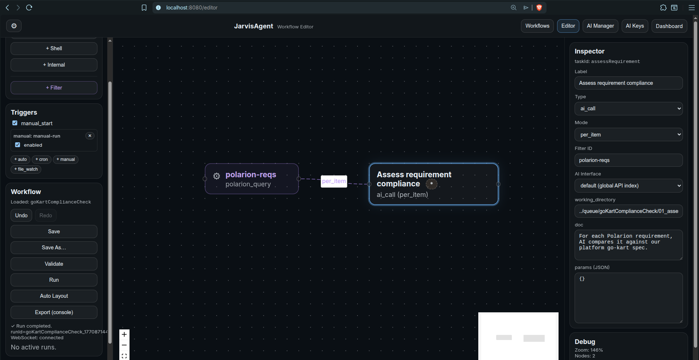

# Go-Kart Procurement Compliance Check — Polarion-Driven Per-Item AI Workflow

## Executive Summary

The **goKartComplianceCheck** workflow demonstrates a new class of JarvisAgent
capability: **live integration with Siemens Polarion ALM** as a filter source
for per-item AI task fan-out.

Instead of reading items from a local CSV file, this workflow:

1. Queries a Polarion REST API for work items using a Lucene expression.
2. Fans out one AI call per work item (requirement).
3. Each AI call compares the requirement against a platform specification and
   produces a structured compliance assessment.

This is the first workflow to combine **three v1.1 features** end-to-end:

- **`polarion_query` filter source** — paginated REST API queries with Bearer
  token authentication against a Polarion server.
- **`per_item` mode with `{{binding.field}}` template substitution** — each
  filter item is injected into PROB file paths and inline content.
- **Rich-text attribute parsing** — Polarion's nested `description` objects
  (`{"type":"text/plain","value":"..."}`) are automatically extracted.

---

## 1. Big Picture

```
+--------------------+                 +--------------------------+
|  polarion-reqs     |    per item     |  assessRequirement       |
|  polarion_query    | ------------->  |  ai_call (per_item)      |
|  type:requirement  | 18 requirements |  18 parallel AI calls    |
+--------------------+                 +--------------------------+
```



### What happens when you click Run

1. **Filter evaluation** — `PolarionClient` sends a paginated GET request to
   `http://localhost:18080/polarion/rest/v1/projects/GoKartProcurement/workitems?query=type:requirement`.
   Bearer token is resolved from KeyManager via `key_name: "polarion"`.

2. **Fan-out** — The runtime creates 18 child task instances
   (`assessRequirement#0` through `assessRequirement#17`), one per requirement.
   Each child receives the Polarion fields as `{{req.*}}` template variables.

3. **Template substitution** — For each child instance, the runtime substitutes
   `{{req.work_item_id}}`, `{{req.title}}`, `{{req.description}}`, etc. into
   both the PROB filename and its inline content.

4. **AI dispatch** — Each child writes its queue files (STNG, TASK, CNTX, PROB)
   into the shared task working directory, then dispatches an async AI request.

5. **Completion** — Output files `PROB_REQ-001_000.output.txt` through
   `PROB_REQ-018_017.output.txt` are written as AI responses arrive. The parent task
   completes when all 18 children succeed.

---

## 2. Prerequisites

### Polarion Mockup Server

The workflow targets a local Polarion mockup that ships with the project:

```bash
cd ../polarionMockup
./bin/Release/mockup
# → Listening on http://0.0.0.0:18080
# → 1 project, 18 work items, 2 users
```

### Polarion PAT (Personal Access Token)

A key named `"polarion"` must exist in the JarvisAgent KeyManager with the
mockup's Bearer token (`1234!@#$`). Add it via the **AI Keys** page in the
web UI.

### Platform Specification

`goKartPlatformSpec.md` must be present in the `workflows/` directory alongside
the `.jcwf` file. It describes the JC Technolabs platform go-kart against which
requirements are assessed.

---

## 3. Workflow File Structure

```
example/workflows/
  goKartComplianceCheck.jcwf    ← workflow definition
  goKartComplianceCheck.md      ← this document
  goKartPlatformSpec.md         ← platform go-kart technical specification
```

At runtime, both files are copied to the `workflows/` directory.

---

## 4. JCWF Anatomy

### 4.1 Filter Definition

```jsonc
"filters": [
  {
    "id": "polarion-reqs",
    "source": {
      "kind": "polarion_query",
      "base_url": "http://localhost:18080/polarion",
      "project_id": "GoKartProcurement",
      "query": "type:requirement",
      "fields": ["id", "title", "description", "status", "severity", "priority"],
      "key_name": "polarion",
      "page_size": 100
    },
    "binding": "req",
    "max_items": 100
  }
]
```

Key points:

- **`kind: "polarion_query"`** — triggers the `PolarionClient` HTTP path
  instead of the CSV or text_lines evaluators.
- **`query: "type:requirement"`** — a Lucene expression evaluated server-side.
  Other useful queries: `severity:blocker AND status:approved`, `title:brak*`.
- **`fields`** — sparse fieldset; only these attributes are requested from the
  API, reducing payload size.
- **`key_name: "polarion"`** — the KeyManager credential used for the
  `Authorization: Bearer <PAT>` header.
- **`binding: "req"`** — all item values are injected with the `req.` prefix
  (e.g. `{{req.title}}`).

### 4.2 Available Template Variables

After filter evaluation, each child task instance has access to:

| Variable | Source | Example Value |
|----------|--------|---------------|
| `{{req.id}}` | JSON:API top-level `id` | `GoKartProcurement/REQ-003` |
| `{{req.work_item_id}}` | Derived (project prefix stripped) | `REQ-003` |
| `{{req.title}}` | Attribute | `Kart weight` |
| `{{req.description}}` | Rich-text `.value` extracted | `The go-kart shall weigh no more than...` |
| `{{req.status}}` | Attribute | `open` |
| `{{req.severity}}` | Attribute | `normal` |
| `{{req.priority}}` | Attribute | `70.0` |
| `{{req.index}}` | 0-based item index | `2` |

`work_item_id` is synthesized by `PolarionClient` — it strips the
`"Project/"` prefix from the JSON:API id, making it safe for use in filenames.

### 4.3 Task Definition

```jsonc
"assessRequirement": {
  "type": "ai_call",
  "mode": "per_item",
  "filter": "polarion-reqs",
  "working_directory": "../queue/goKartComplianceCheck/01_assessRequirement",
  "queue_binding": {
    "stng_files": [{ "path": "STNG_succinct.txt", "content": "..." }],
    "task_files": [{ "path": "TASK_compareRequirement.txt", "content": "..." }],
    "cntx_files": ["../../../workflows/goKartPlatformSpec.md"],
    "prob_files": [{
      "path": "PROB_{{req.work_item_id}}_{{req.index_padded}}.txt",
      "content": "Requirement ID: {{req.work_item_id}}\nTitle: {{req.title}}\n..."
    }]
  }
}
```

- **`mode: "per_item"`** + **`filter: "polarion-reqs"`** — triggers fan-out.
- **`cntx_files`** — the platform spec is materialized as `CNTX_goKartPlatformSpec.md`
  in the task working directory. Every child shares this context.
- **`prob_files`** — template-substituted per child. `PROB_REQ-001_000.txt` through
  `PROB_REQ-018_017.txt`, each containing that requirement's details. The
  `{{req.index_padded}}` suffix ensures unique filenames even if two work items
  shared the same ID prefix.

---

## 5. Runtime Artifacts

After a successful run, the task working directory contains:

```
queue/goKartComplianceCheck/01_assessRequirement/
  STNG_succinct.txt                    ← written once (shared)
  TASK_compareRequirement.txt          ← written once (shared)
  CNTX_goKartPlatformSpec.md           ← materialized from upstream path

  PROB_REQ-001_000.txt                 ← per-item input (requirement details)
  PROB_REQ-001_000.output.txt          ← per-item output (AI compliance assessment)
  PROB_REQ-002_001.txt
  PROB_REQ-002_001.output.txt
  ...
  PROB_REQ-018_017.txt
  PROB_REQ-018_017.output.txt
```

Additionally, a filter manifest is written to:

```
workflows/polarion-reqs/polarion-reqs.manifest.json
```

This manifest enables **incremental re-runs**: on subsequent executions, only
items whose source data has changed are re-evaluated.

---

## 6. Sample Output

### COMPLIANT (REQ-002 — Acceleration)

```
- Compliance Status: COMPLIANT
- Requirement: Acceleration 0–50 km/h in ≤ 5 seconds
- Platform Value: 0–50 km/h in 4.8 seconds

Assessment:
- The platform go-kart meets the acceleration requirement with a 0–50 km/h
  time of 4.8 seconds, within the specified limit of 5 seconds.
- No modifications required.
```

### NON-COMPLIANT (REQ-001 — Maximum Speed)

```
- Compliance Status: NON-COMPLIANT
- Requirement: Minimum maximum speed 60 km/h
- Platform Value: 55 km/h maximum speed

- Gap: 5 km/h (8.3% below requirement)
- Change Required: Increase top speed via powertrain upgrade or gear ratio change.
- Estimated Cost: ~45,000 EUR
- Timeline: 4–6 months
- Difficulty: MEDIUM
```

### Known Non-Compliant Requirements

The platform specification was deliberately designed with four gaps:

| REQ | Title | Gap | Est. Cost | Difficulty |
|-----|-------|-----|-----------|------------|
| REQ-001 | Maximum speed | 55 vs 60 km/h | €45,000 | MEDIUM |
| REQ-007 | Hydraulic disc brakes | Rear uses drums | €18,000 | MEDIUM |
| REQ-014 | Lateral seat support | Basic bolsters only | €18–25K | MEDIUM |
| REQ-018 | Reflective strips | Not fitted | €3,500 | LOW |

---

## 7. New Features Demonstrated

### 7.1 `polarion_query` Filter Source (JCWF v1.1)

This is the first filter kind that fetches data from an **external REST API**
rather than a local file.

**How it works internally:**

1. `FilterEngine::Evaluate()` dispatches to `EvaluatePolarionQuery()`.
2. `PolarionClient::FetchAll()` paginates through the Polarion REST API.
3. Each page is parsed from JSON:API format into `FilterItem` objects.
4. Rich-text fields (like `description`) are detected and their `.value`
   is extracted automatically.
5. A `work_item_id` synthetic field is derived by stripping the project prefix.
6. Per-item JSON files are written to the workflow base directory for debugging.

**Authentication:**

Polarion uses **Personal Access Tokens** (PATs) sent as Bearer tokens.
The `key_name` field in the filter source maps to a credential in the
JarvisAgent KeyManager. The token is never stored in the JCWF file.

**Pagination:**

The client automatically fetches multiple pages if the result set exceeds
`page_size`. It stops when fewer items are returned than the page size or
when `max_items` is reached.

### 7.2 Rich-Text Attribute Parsing

Polarion represents structured text fields as nested objects:

```json
"description": {
  "type": "text/plain",
  "value": "The go-kart shall weigh no more than 120 kg."
}
```

`PolarionClient::ParseJsonApiPage()` handles both plain string attributes and
these rich-text objects. When a field is an object with a `"value"` key, the
value string is extracted. This is transparent to the workflow author — they
simply use `{{req.description}}` and get the text.

### 7.3 Per-Item AI Fan-Out with External Data

Previous per-item workflows (like `portfolioDividendAnalysis`) read items from
a local CSV file. This workflow proves the same per-item mechanism works with
**live API data** — the number of items, their content, and their structure are
all determined at runtime by the Polarion query result.

---

## 8. Key C++ Components

| Component | Role in This Workflow |
|-----------|----------------------|
| `PolarionClient` | HTTP GET with Bearer auth, JSON:API pagination, rich-text parsing |
| `FilterEngine` | Dispatches `polarion_query` kind to `PolarionClient::FetchAll()` |
| `FilterManifestManager` | Writes manifest for incremental freshness tracking |
| `WorkflowRuntimeManager` | Per-item fan-out: `DispatchFilterEvaluation` → `FanOutPerItemChildren` |
| `AiCallTaskExecutor` | Template substitution on `{{req.*}}`, queue file materialization |

---

## 9. How to Run

```bash
# 1. Start the Polarion mockup (separate terminal)
cd ../polarionMockup
./bin/Release/mockup

# 2. Ensure the workflow and spec are in the runtime folder
cp example/workflows/goKartComplianceCheck.jcwf workflows/
cp example/workflows/goKartPlatformSpec.md workflows/

# 3. Ensure the "polarion" key exists in AI Keys (Bearer token: 1234!@#$)

# 4. Start JarvisAgent
./bin/Release/jarvisAgent

# 5. Open the web UI → Workflows → Go-Kart Procurement Compliance Check → Run
```

The run completes in approximately 5 seconds (18 parallel AI calls).

---

## 10. Adapting This Workflow

### Different Polarion Query

Change the `query` field to target specific requirements:

```jsonc
"query": "severity:blocker AND status:approved"   // → 3 items
"query": "status:draft OR status:open"             // → 9 items
"query": "title:brak*"                             // → 1 item (brakes)
```

### Real Polarion Server

Replace `base_url` with the production Polarion URL and update the `key_name`
to point to a valid PAT credential:

```jsonc
"base_url": "https://polarion.example.com/polarion",
"key_name": "polarion-prod"
```

### Adding a Summary Task

To aggregate all 18 assessments into a single report (like the dividend
workflow does), add a second task with `depends_on: ["assessRequirement"]`
and use a glob pattern in `cntx_files`:

```jsonc
"complianceSummary": {
  "type": "ai_call",
  "mode": "single",
  "depends_on": ["assessRequirement"],
  "working_directory": "../queue/goKartComplianceCheck/02_complianceSummary",
  "queue_binding": {
    "cntx_files": ["../01_assessRequirement/PROB_*.output.txt"],
    "prob_files": [{ "path": "PROB_summarize.txt", "content": "..." }]
  }
}
```

The glob pattern `PROB_*.output.txt` dynamically collects all per-item outputs
regardless of how many requirements the Polarion query returns.

---
