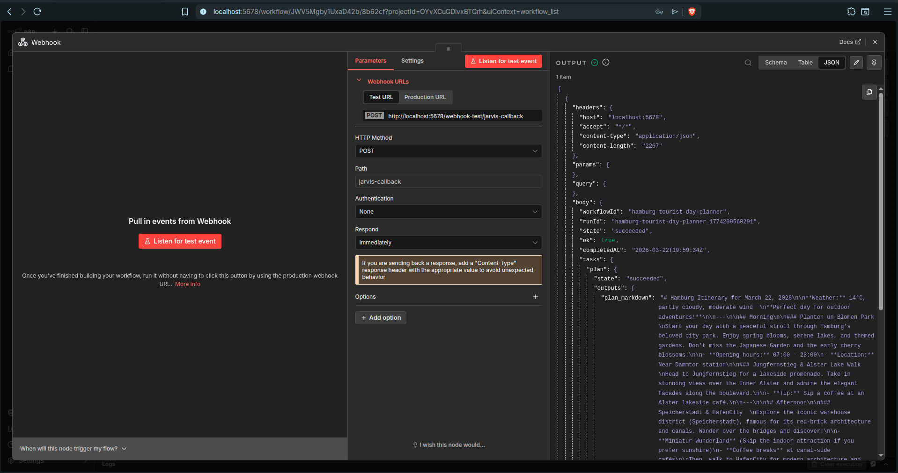

# hamburg‑tourist‑day‑planner — n8n Integration Demo

## Summary

The **hamburg‑tourist‑day‑planner** workflow demonstrates how JarvisAgent integrates with **n8n** (or any external system). An n8n workflow fetches live weather data for Hamburg, then triggers this JCWF workflow via `POST /api/webhook/hamburg-tourist-day-planner`, passing weather context. JarvisAgent generates a weather‑aware tourist day plan with AI.

This workflow shows:

- **External triggering** — n8n (or `curl`) starts a JCWF workflow via REST
- **Context injection** — weather data flows from the run context into AI prompt templates via `{{variable}}` expansion in inline `queue_binding` content
- **Standard ai_call pattern** — STNG/TASK/CNTX/PROB queue files, all inline

---

## Pipeline

```
n8n (or curl)
  │
  │  POST /api/webhook/hamburg-tourist-day-planner
  │  { context: { date, timezone, rainCategory, weatherJson } }
  │
  ▼
┌──────────────────────────────────────────────┐
│ plan (ai_call)                               │
│ Queue: STNG_plan + TASK_plan + CNTX_weather  │
│        + PROB_plan                           │
│ Output: PROB_plan.output.txt (Markdown)      │
└──────────────────────────────────────────────┘
```

---

## Task: plan (ai_call)

Generates a Markdown day plan using weather context injected from the run context.

| Field | Value |
|-------|-------|
| Type | `ai_call` |
| Working directory | `../queue/hamburg-tourist-day-planner/01_plan` |
| Inputs (from context) | `date`, `timezone`, `rainCategory`, `weatherJson` |
| Output | `plan_markdown` (string) |
| Timeout | 120 s |

The task declares `inputs` that are resolved from the **run context** (populated by the webhook handler). The `{{variable}}` placeholders in the inline CNTX and PROB content are expanded by the runtime before the queue files are written.

### Queue files

| File | Role | Content |
|------|------|---------|
| `STNG_plan.txt` | Style | "Output only raw Markdown. No fences." |
| `TASK_plan.txt` | Instructions | Activity recommendations adapted to rain category |
| `CNTX_weather.txt` | Context | `Date: {{date}}`, `Rain category: {{rainCategory}}`, weather JSON |
| `PROB_plan.txt` | Request | "Generate the Hamburg tourist day plan for {{date}}" |

---

## Context Variables (provided by caller)

| Variable | Required | Description |
|----------|----------|-------------|
| `date` | Yes | Target date (e.g. `2026-03-21`) |
| `timezone` | No | IANA timezone (default: `Europe/Berlin`) |
| `rainCategory` | Yes | `no_rain`, `some_rain`, or `rain` |
| `weatherJson` | Yes | Raw weather forecast JSON string |

Additional context set automatically by the webhook handler:

| Variable | Description |
|----------|-------------|
| `webhook_request_path` | Absolute path to the persisted `request.json` |
| `webhook_trigger_id` | Trigger ID that matched the incoming request |
| `callbackUrl` | Callback URL for completion notification (if provided) |

---

## Integration Flow

1. **n8n** fetches weather data for Hamburg (e.g. from Open‑Meteo: `GET https://api.open-meteo.com/v1/forecast?latitude=53.5511&longitude=9.9937&daily=precipitation_sum,weather_code&timezone=Europe%2FBerlin`).
2. **n8n** sends `POST /api/webhook/hamburg-tourist-day-planner` with weather context.
3. **JarvisAgent** verifies the webhook trigger, persists the request JSON to disk, creates a workflow run, and seeds the run context with the provided fields.
4. The `plan` ai_call task writes STNG/TASK/CNTX/PROB files (with `{{variable}}` expansion), and the SessionManager dispatches the AI query.
5. The AI response is written to `PROB_plan.output.txt`.
6. If `callbackUrl` was provided, the runtime POSTs the completion payload back to the caller automatically.

---

## n8n Round‑Trip (End‑to‑End)



The screenshot shows the full round‑trip: n8n triggers the JarvisAgent webhook, the AI generates a Hamburg day plan, and JarvisAgent POSTs the completion callback — including the full AI output — back to n8n.

### Setup

1. **Install n8n** — `npm install -g n8n` (requires Node.js 18+).
2. **Install the custom node** — the JarvisAgent n8n node lives in `integration/n8n-node/`. Install it into n8n's custom extensions:
   ```bash
   cd ~/.n8n/nodes
   npm install /path/to/jarvisAgent/integration/n8n-node
   ```
   The package must be named `n8n-nodes-jarvisagent` (n8n requires the `n8n-nodes-*` prefix for community node discovery).
3. **Start n8n** — `n8n start` (default: `http://localhost:5678`).
4. **Start JarvisAgent** — ensure j9t is running on `http://localhost:8080` with the `hamburg-tourist-day-planner` workflow loaded.
5. **Reload triggers** — if the workflow was added at runtime:
   ```bash
   curl -s -X POST http://localhost:8080/api/workflows/reload | jq .
   ```

### n8n Workflow Setup

**Workflow A — Trigger + JarvisAgent node:**

1. Add a **"Trigger manually"** node.
2. Add a **"JarvisAgent: Start Workflow"** node with:
   - **Base URL**: `http://localhost:8080`
   - **Endpoint**: Webhook (recommended)
   - **Workflow ID**: `hamburg-tourist-day-planner`
   - **Callback URL**: `http://localhost:5678/webhook/jarvis-callback` (production URL of workflow B)
   - **Context (JSON)**:
     ```json
     {"date": "2026-03-22", "timezone": "Europe/Berlin", "rainCategory": "no_rain", "weatherJson": "{\"temp\":14,\"wind\":12,\"description\":\"partly cloudy\"}"}
     ```

**Workflow B — Callback receiver:**

1. Add a **"Webhook"** trigger node with **HTTP Method**: POST, **Path**: `jarvis-callback`.
2. **Publish** the workflow so the production URL is active permanently.

### How the Round‑Trip Works

1. **n8n** sends `POST /api/webhook/hamburg-tourist-day-planner` with context and a `callbackUrl`.
2. **JarvisAgent** validates the request (HMAC if a secret is configured), persists `request.json`, and enqueues the workflow run. Returns HTTP 202 with `{ runId, workflowId, triggerId, ok }`.
3. The `plan` ai_call task expands `{{variable}}` placeholders, writes STNG/TASK/CNTX/PROB queue files, and dispatches the AI query.
4. The AI response is written to `PROB_plan.output.txt`.
5. On run completion, JarvisAgent POSTs the callback payload to `callbackUrl`:
   ```json
   {
     "workflowId": "hamburg-tourist-day-planner",
     "runId": "hamburg-tourist-day-planner_17742...",
     "state": "succeeded",
     "ok": true,
     "completedAt": "2026-03-22T19:51:34Z",
     "tasks": {
       "plan": {
         "state": "succeeded",
         "outputs": {
           "plan_markdown": "# Hamburg Itinerary for March 22, 2026\n..."
         }
       }
     }
   }
   ```
6. **n8n** receives the payload in its webhook node and can route the AI output downstream (email, Slack, Google Sheets, etc.).

### HMAC Signing (optional)

To protect the webhook, add a shared secret to the JCWF trigger:

```json
"triggers": [{
  "type": "webhook",
  "id": "webhook",
  "enabled": true,
  "params": { "secret": "my-shared-secret" }
}]
```

Then set the same secret in the n8n node's **HMAC Secret** field. The node computes `HMAC-SHA256(secret, requestBody)` and sends it as `X-Webhook-Signature: sha256=<hex>`. JarvisAgent verifies the signature with constant‑time comparison before processing the request.

---

## Testing with curl

### Basic trigger (no secret)

```bash
curl -s -X POST http://localhost:8080/api/webhook/hamburg-tourist-day-planner \
  -H 'Content-Type: application/json' \
  -d '{
    "context": {
      "date": "2026-03-21",
      "timezone": "Europe/Berlin",
      "rainCategory": "some_rain",
      "weatherJson": "{\"temp_max\": 8, \"precipitation_sum\": 2.1, \"weather_code\": 61}"
    }
  }'
```

### Trigger with HMAC signature

```bash
SECRET="my-shared-secret"
BODY='{"context":{"date":"2026-03-22","timezone":"Europe/Berlin","rainCategory":"no_rain","weatherJson":"{}"}}'
SIG=$(echo -n "$BODY" | openssl dgst -sha256 -hmac "$SECRET" | awk '{print $2}')

curl -s -X POST http://localhost:8080/api/webhook/hamburg-tourist-day-planner \
  -H 'Content-Type: application/json' \
  -H "X-Webhook-Signature: sha256=$SIG" \
  -d "$BODY"
```

### Trigger with callback URL

```bash
curl -s -X POST http://localhost:8080/api/webhook/hamburg-tourist-day-planner \
  -H 'Content-Type: application/json' \
  -d '{
    "callbackUrl": "http://127.0.0.1:9999/callback",
    "context": {
      "date": "2026-03-22",
      "timezone": "Europe/Berlin",
      "rainCategory": "rain",
      "weatherJson": "{\"temp\":8,\"wind\":25,\"description\":\"thunderstorm\"}"
    }
  }'
```

### Check run status

```bash
curl -s http://localhost:8080/api/workflow-runs/active | jq .
```

---

## E2E Test Matrix (verified 2026‑03‑22)

| # | Test | Expected | Result |
|---|------|----------|--------|
| 1 | Non‑existent workflow ID | 404 `no_webhook_trigger` | ✅ |
| 2 | Invalid workflow ID (`..`) | 400 `invalid_workflow_id` | ✅ |
| 3 | Basic webhook + context (no secret) | 202, run succeeds | ✅ |
| 4 | `/api/workflows/reload` re‑binds triggers | Webhook active after reload | ✅ |
| 5a | Missing `X-Webhook-Signature` (secret set) | 401 `missing_signature` | ✅ |
| 5b | Wrong HMAC signature | 401 `invalid_signature` | ✅ |
| 5c | Valid HMAC signature | 202, run succeeds | ✅ |
| 6 | Completion callback to local listener | POST received, HTTP 200 | ✅ |
| 7 | Empty body + valid HMAC | 202 (no context) | ✅ |
| 8 | Callback to unreachable URL | Run succeeds, callback warns (15 s timeout) | ✅ |
| 9 | n8n custom node → webhook → AI → callback → n8n | Full round‑trip with output content | ✅ |
