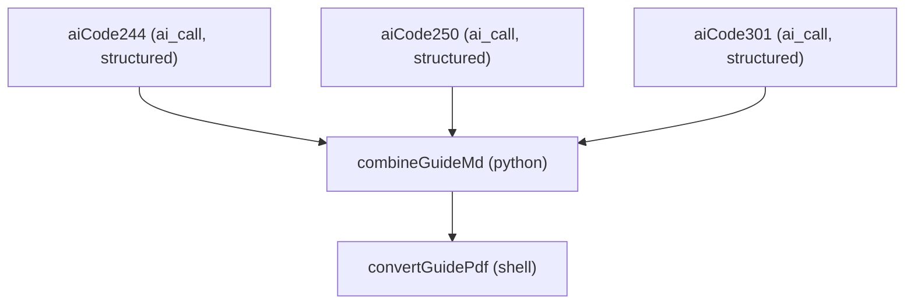
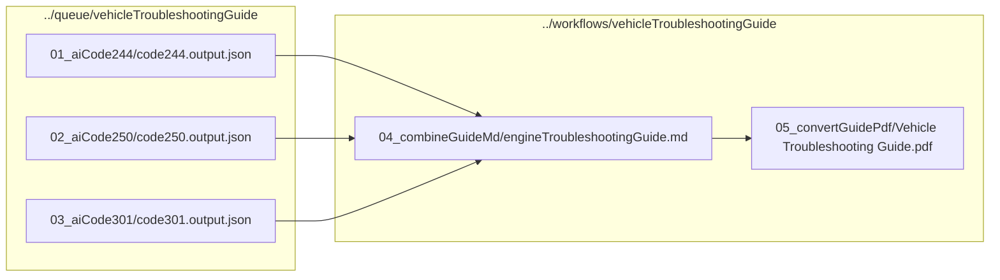

# vehicleTroubleshootingGuide.jcwf

Documentation for the `vehicleTroubleshootingGuide` workflow (JarvisAgent / JCWF).

## Purpose

This workflow generates a **Vehicle Troubleshooting Guide** from three AI-generated Mermaid control-flow graphs (codes **244**, **250**, **301**).

- Tasks **aiCode244/250/301** produce a **schema-validated JSON** object per code: `{"title": "...", "mermaid": "flowchart TD ..."}`.
- Task **combineGuideMd** merges the three JSONs into one markdown document and wraps each diagram source in a ```` ```mermaid ```` fence. Because the combiner owns the fence, no variation in the AI reply can damage the final document.
- Task **convertGuidePdf** converts the combined Markdown to a PDF via `mmdc` + `pandoc` (shell task).

### Structured output on every AI step

All three `aiCode*` tasks use the JCWF **structured-output** pathway introduced by the AI dispatch refactor:

- `output_schema` declares a Draft 2020-12 schema with `title` and `mermaid` as required string fields (`additionalProperties: false` enforces the shape).
- `output_retries: 3` — the runtime validates the AI reply, and on mismatch re-dispatches with the validator's error list as a correction message for up to three attempts.
- The validated reply lands at `<stem>.output.json`.
- This means the AI **never writes markdown fences itself** — the `mermaid` field carries raw Mermaid source, and `combineEngineTroubleshootingGuide.py` adds the ```` ```mermaid ```` wrapping.

## Triggers

- `auto-run` — type `auto` (enabled: `True`)
- `manual-run` — type `manual` (enabled: `True`)

## Task graph



## Dataflow



## Output locations

The workflow writes artifacts to two places:

- **Queue outputs** (schema-validated JSON): `../queue/vehicleTroubleshootingGuide/<task>/`
- **Workflow outputs** (final docs): `../workflows/vehicleTroubleshootingGuide/<task>/`

Expected key outputs:

- `../queue/vehicleTroubleshootingGuide/01_aiCode244/code244.output.json`
- `../queue/vehicleTroubleshootingGuide/02_aiCode250/code250.output.json`
- `../queue/vehicleTroubleshootingGuide/03_aiCode301/code301.output.json`
- `../workflows/vehicleTroubleshootingGuide/04_combineGuideMd/engineTroubleshootingGuide.md`
- `../workflows/vehicleTroubleshootingGuide/05_convertGuidePdf/Vehicle Troubleshooting Guide.pdf`

## Task-by-task breakdown

### aiCode244

- **Type:** `ai_call` (structured)
- **Label:** AI: CFG for code 244 (structured)
- **Working directory:** `../queue/vehicleTroubleshootingGuide/01_aiCode244`
- **Output schema:** `{title: string, mermaid: string}` (both required, `additionalProperties: false`)
- **Output retries:** `3`
- **File outputs:** `code244.output.json`

#### STNG files
- `STNG_structured.txt`
```
Return ONLY a JSON object that matches the declared schema.
No prose, no markdown fences — raw JSON.
The 'mermaid' field MUST contain the raw Mermaid flowchart source (no ``` fence).
```

#### TASK files
- `TASK_generateCfg.txt` — instructs the AI to emit `{title, mermaid}` JSON, with the same Mermaid syntax rules as before (no parens in labels, short label length, etc.).

#### CNTX files
- `CNTX_needMermaidCfg.txt` — brief context that this is part of a troubleshooting guide.

#### PROB files
- `PROB_code244.txt` — scenario prose for engine code 244 (engine temperature / cooling pump / circuit breaker chain).

### aiCode250

Same structured-output shape as `aiCode244`. PROB describes engine code 250 (tire alignment).

### aiCode301

Same structured-output shape as `aiCode244`. PROB describes engine code 301 (headlights circuit breaker).

### combineGuideMd

- **Type:** `python`
- **Label:** Combine CFG JSON into one markdown guide
- **Working directory:** `../workflows/vehicleTroubleshootingGuide/04_combineGuideMd`
- **Depends on:** `aiCode244`, `aiCode250`, `aiCode301`
- **File inputs:**
  - `../../../queue/vehicleTroubleshootingGuide/01_aiCode244/code244.output.json`
  - `../../../queue/vehicleTroubleshootingGuide/02_aiCode250/code250.output.json`
  - `../../../queue/vehicleTroubleshootingGuide/03_aiCode301/code301.output.json`
- **File outputs:** `engineTroubleshootingGuide.md`

Calls `combineEngineTroubleshootingGuide.buildEngineTroubleshootingGuide(...)` with:

- `code244JsonPath`, `code250JsonPath`, `code301JsonPath` — the three schema-validated JSONs
- `outputMdPath` — the combined Markdown file in the workflow folder

The script reads each JSON (`{title, mermaid}`), emits one `## <title>` heading per section, and wraps the `mermaid` source in a ```` ```mermaid ```` fence. The combiner owns the fence layer so the final artifact cannot be broken by variation in the AI reply.

### convertGuidePdf

- **Type:** `shell`
- **Label:** Convert guide MD -> PDF (mmdc + pandoc)
- **Working directory:** `../workflows/vehicleTroubleshootingGuide/05_convertGuidePdf`
- **Depends on:** `combineGuideMd`
- **File inputs:** `../04_combineGuideMd/engineTroubleshootingGuide.md`
- **File outputs:** `Vehicle Troubleshooting Guide.pdf`

Runs `scripts/mermaidMdToPdf.sh` which pre-renders each ```` ```mermaid ```` block to a PNG via `mmdc`, then calls `pandoc` (pdflatex engine) to produce the final PDF.

Configured command:

```bash
scripts/mermaidMdToPdf.sh  {{input[0]}}  {{output[0]}}
```

## Notes on the structured-output upgrade

This workflow used to ship raw Markdown from each AI call (with a ```` ```mermaid ```` fence inside the reply). That made it vulnerable to the auto fence-strip heuristic — Haiku occasionally wraps its entire reply in an outer fence, and the runtime's strip pass would accidentally eat the intended ```` ```mermaid ```` wrapper, leaving raw Mermaid source to render as text in the final PDF.

Converting each AI call to schema-validated JSON eliminates the class of bug by construction: the AI never produces a fence, so there's no fence for the strip pass to mistakenly remove. The combiner owns the fence layer and always wraps the diagram source correctly.
