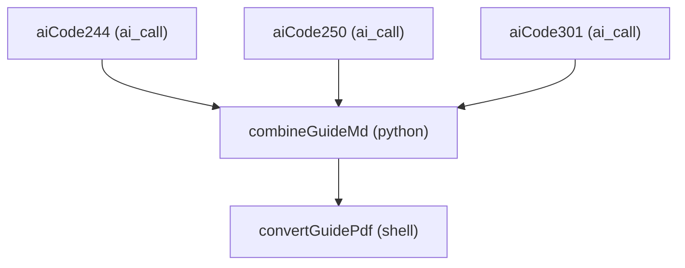
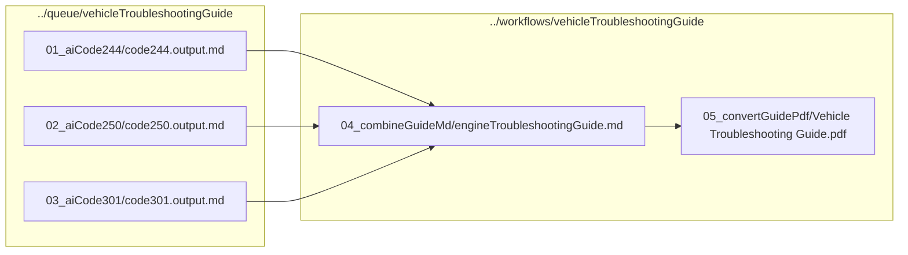

# vehicleTroubleshootingGuide.jcwf

Documentation for the `vehicleTroubleshootingGuide` workflow (JarvisAgent / JCWF).

## Purpose

This workflow generates a **Vehicle Troubleshooting Guide** from three AI-generated Mermaid control-flow graphs (codes **244**, **250**, **301**).

- Tasks **aiCode244/250/301** ask the AI to produce one Mermaid flowchart per code.
- Task **combineGuideMd** merges those Markdown files into one combined `engineTroubleshootingGuide.md`.
- Task **convertGuidePdf** converts the combined Markdown to a PDF via `md2pdf` (shell task).

## Triggers

- `auto-run` — type `auto` (enabled: `True`)
- `manual-run` — type `manual` (enabled: `True`)

## Task graph



## Dataflow



## Output locations

The workflow writes artifacts to two places:

- **Queue outputs** (AI results): `../queue/vehicleTroubleshootingGuide/<task>/`
- **Workflow outputs** (final docs): `../workflows/vehicleTroubleshootingGuide/<task>/`

Expected key outputs:

- `../queue/vehicleTroubleshootingGuide/01_aiCode244/code244.output.md`
- `../queue/vehicleTroubleshootingGuide/02_aiCode250/code250.output.md`
- `../queue/vehicleTroubleshootingGuide/03_aiCode301/code301.output.md`
- `../workflows/vehicleTroubleshootingGuide/04_combineGuideMd/engineTroubleshootingGuide.md`
- `../workflows/vehicleTroubleshootingGuide/05_convertGuidePdf/Vehicle Troubleshooting Guide.pdf`

## Task-by-task breakdown

### aiCode244

- **Type:** `ai_call`
- **Label:** AI: CFG for code 244
- **Working directory:** `../queue/vehicleTroubleshootingGuide/01_aiCode244`
- **File outputs:**
  - `code244.output.md`

#### AI prompt inputs (written into the task queue folder)

#### STNG files
- `STNG_succinct.txt`
```
succinct
```
#### TASK files
- `TASK_generateCfgMermaidMd.txt`
```
Generate a control flow graph using Mermaid. Output MUST be Markdown containing exactly one ```mermaid``` flowchart diagram (no extra prose).
```
#### CNTX files
- `CNTX_needMermaidCfg.txt`
```
for a troubleshooting guide, a mermaid control graph is needed to show the troubleshooting steps
```
#### PROB files
- `PROB_code244.txt`
```
engine code 244 -> prompt if code 244 'engine temperature' is active check if there is code 245 'low cooling liquid' present. if so floow the instructions there. if not check if the radiator is clogged. if so clean it and were done. if not, check if the cooling pump runs. if not check if the circuit breaker is in. if not check and fix wiring. put back in circuit breaker. check if cooling pump works now. if yes we're done. if not replace cooling pump.
```

#### Required AI response format

The TASK instruction for this AI call requires:

> Output MUST be Markdown containing exactly one ```mermaid``` flowchart diagram (no extra prose).


### aiCode250

- **Type:** `ai_call`
- **Label:** AI: CFG for code 250
- **Working directory:** `../queue/vehicleTroubleshootingGuide/02_aiCode250`
- **File outputs:**
  - `code250.output.md`

#### AI prompt inputs (written into the task queue folder)

#### STNG files
- `STNG_succinct.txt`
```
succinct
```
#### TASK files
- `TASK_generateCfgMermaidMd.txt`
```
Generate a control flow graph using Mermaid. Output MUST be Markdown containing exactly one ```mermaid``` flowchart diagram (no extra prose).
```
#### CNTX files
- `CNTX_needMermaidCfg.txt`
```
for a troubleshooting guide, a mermaid control graph is needed to show the troubleshooting steps
```
#### PROB files
- `PROB_code250.txt`
```
e.g. engine code 250 'tire alignment' means uneven tire wire. if code 250 is present then adjust the alignment of the wheels as per proceedure 5 from the tire manual.
```

#### Required AI response format

The TASK instruction for this AI call requires:

> Output MUST be Markdown containing exactly one ```mermaid``` flowchart diagram (no extra prose).


### aiCode301

- **Type:** `ai_call`
- **Label:** AI: CFG for code 301
- **Working directory:** `../queue/vehicleTroubleshootingGuide/03_aiCode301`
- **File outputs:**
  - `code301.output.md`

#### AI prompt inputs (written into the task queue folder)

#### STNG files
- `STNG_succinct.txt`
```
succinct
```
#### TASK files
- `TASK_generateCfgMermaidMd.txt`
```
Generate a control flow graph using Mermaid. Output MUST be Markdown containing exactly one ```mermaid``` flowchart diagram (no extra prose).
```
#### CNTX files
- `CNTX_needMermaidCfg.txt`
```
for a troubleshooting guide, a mermaid control graph is needed to show the troubleshooting steps
```
#### PROB files
- `PROB_code301.txt`
```
code 301 is present 'headlights light circut breaker tripped'. If code 301 is present check the wiring of the headlights. if there is a short or faulty wiring then fix the wiring. then put circuit breaker back in and switch on the headlights. if the breaker does not trip again, we are done. if it trips again then disconnect left light and put circuit breaker back in. switch on lights. if circuit breakers stays in, replace left light. if breaker trips replace right light.
```

#### Required AI response format

The TASK instruction for this AI call requires:

> Output MUST be Markdown containing exactly one ```mermaid``` flowchart diagram (no extra prose).


### combineGuideMd

- **Type:** `python`
- **Label:** Combine CFG markdown into one guide
- **Working directory:** `../workflows/vehicleTroubleshootingGuide/04_combineGuideMd`
- **Depends on:** `aiCode244`, `aiCode250`, `aiCode301`
- **File inputs:**
  - `../../../queue/vehicleTroubleshootingGuide/01_aiCode244/code244.output.md`
  - `../../../queue/vehicleTroubleshootingGuide/02_aiCode250/code250.output.md`
  - `../../../queue/vehicleTroubleshootingGuide/03_aiCode301/code301.output.md`
- **File outputs:**
  - `engineTroubleshootingGuide.md`

This task calls `combineEngineTroubleshootingGuide.buildEngineTroubleshootingGuide(...)` with:

- `inputMdPaths`: the three AI-produced Markdown files from the queue folder
- `outputMdPath`: the combined Markdown file in the workflow folder

### convertGuidePdf

- **Type:** `shell`
- **Label:** Convert guide MD -> PDF (md2pdf-mermaid)
- **Working directory:** `../workflows/vehicleTroubleshootingGuide/05_convertGuidePdf`
- **Depends on:** `combineGuideMd`
- **File inputs:**
  - `../04_combineGuideMd/engineTroubleshootingGuide.md`
- **File outputs:**
  - `Vehicle Troubleshooting Guide.pdf`

This task runs a shell script to invoke `md2pdf` and produce the final PDF.

Configured command:

```bash
scripts/convertGuidePdf.sh
  ${input[0]}
  ${output[0]}
```

## Notes on Mermaid compatibility

Mermaid node labels are sensitive to quoting and special characters. In this workflow the PROB prompt text is written without extra quotes around phrases like engine code names (e.g. `code 244 engine temperature`). This avoids generating Mermaid like `A[Code 244 "Engine Temperature" Active?]` which can fail to parse depending on the renderer settings.
