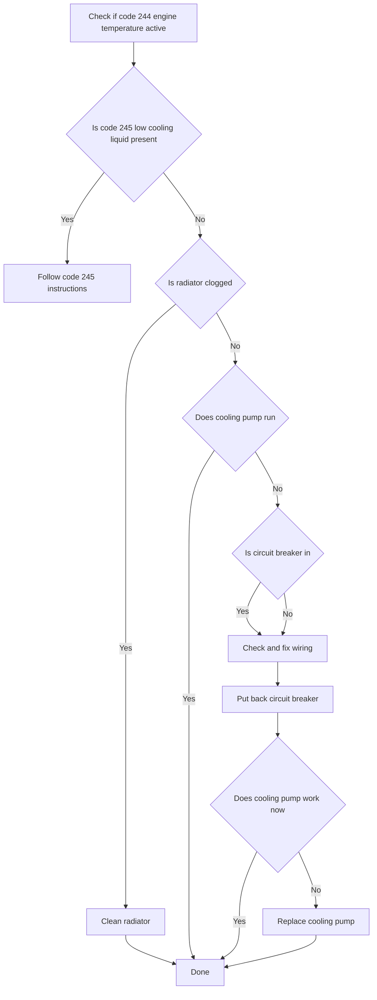
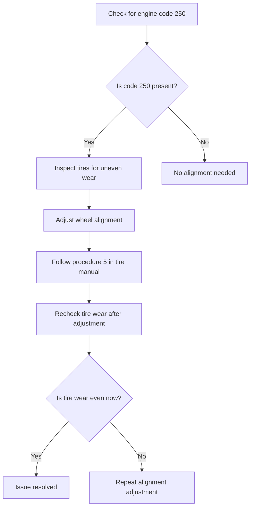
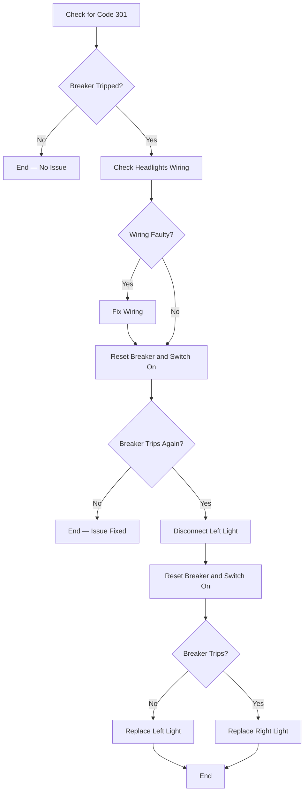

# engine troubleshooting guide

## table of contents
- [Code 244 Engine Temperature](#code-244)
- [Code 250 — Tire Alignment](#code-250)
- [Code 301 — Headlights Circuit Breaker](#code-301)

## introduction
This troubleshooting guide is used to repair the vehicle. Usage: read out the engine codes and follow the troubleshooting steps.

## Code 244 Engine Temperature

## Code 250 — Tire Alignment

## Code 301 — Headlights Circuit Breaker

