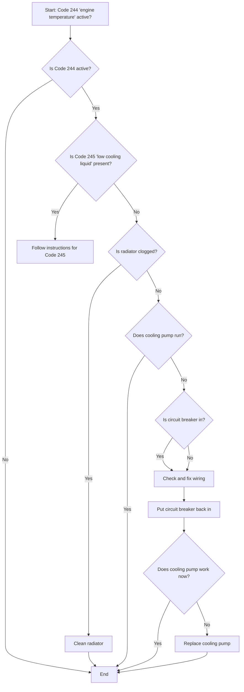
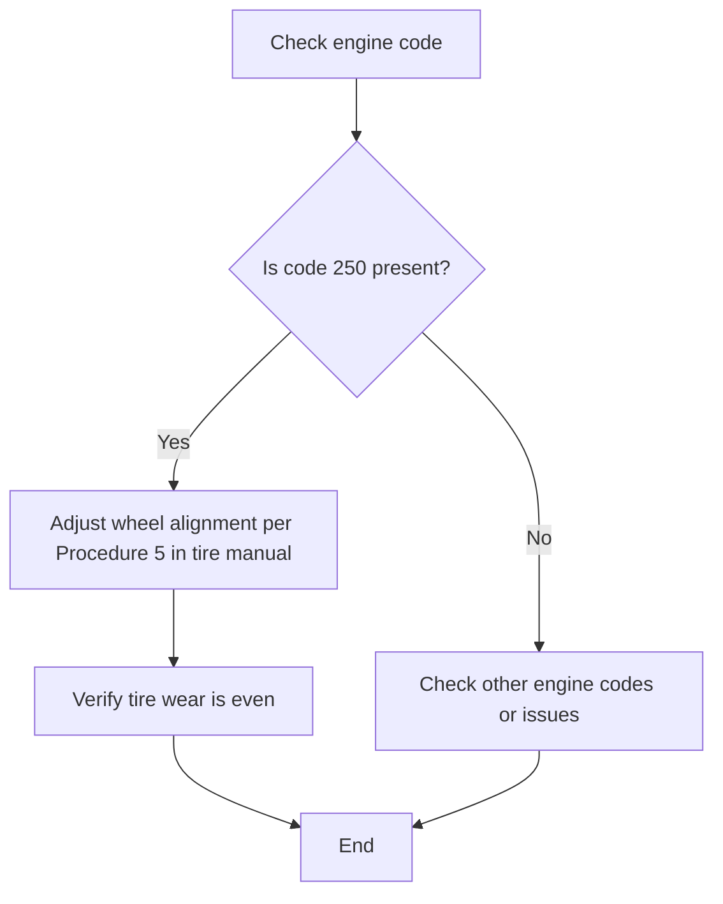
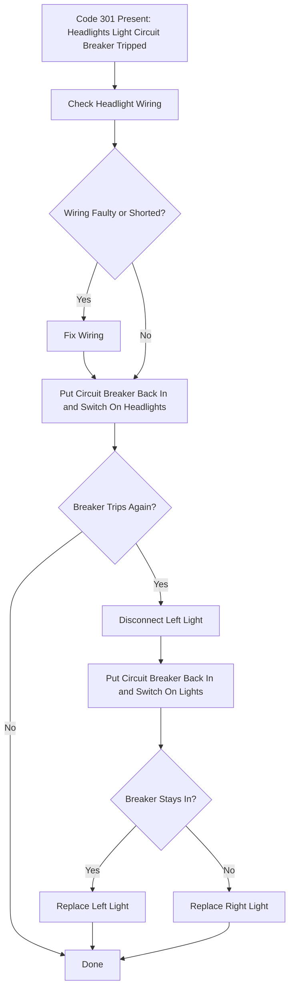

# engine troubleshooting guide

## table of contents
- [code 244](#code-244)
- [code 250](#code-250)
- [code 301](#code-301)

## introduction
This troubleshooting guide is used to repair the vehicle.Usage: read out the engine codes and follow the troubleshooting steps.

## code 244

## code 250

## code 301

